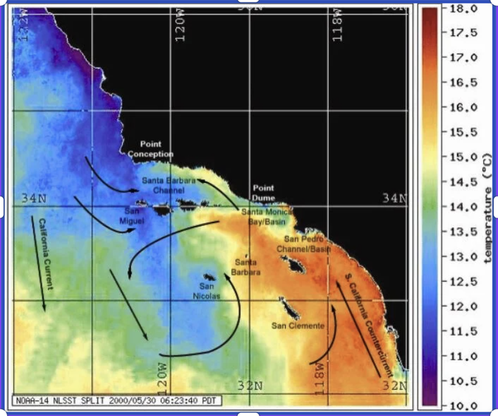
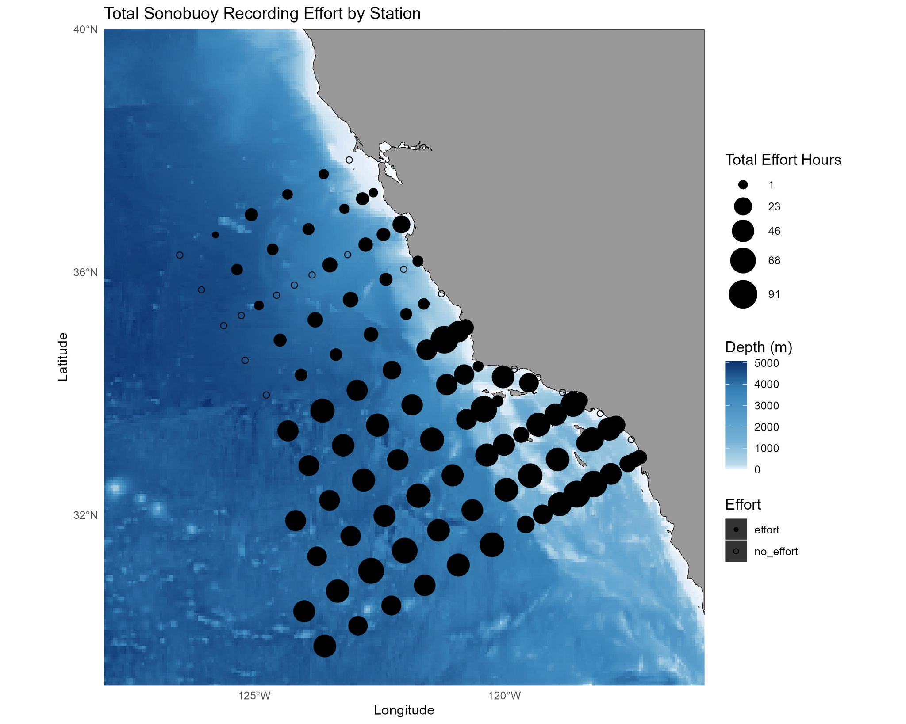
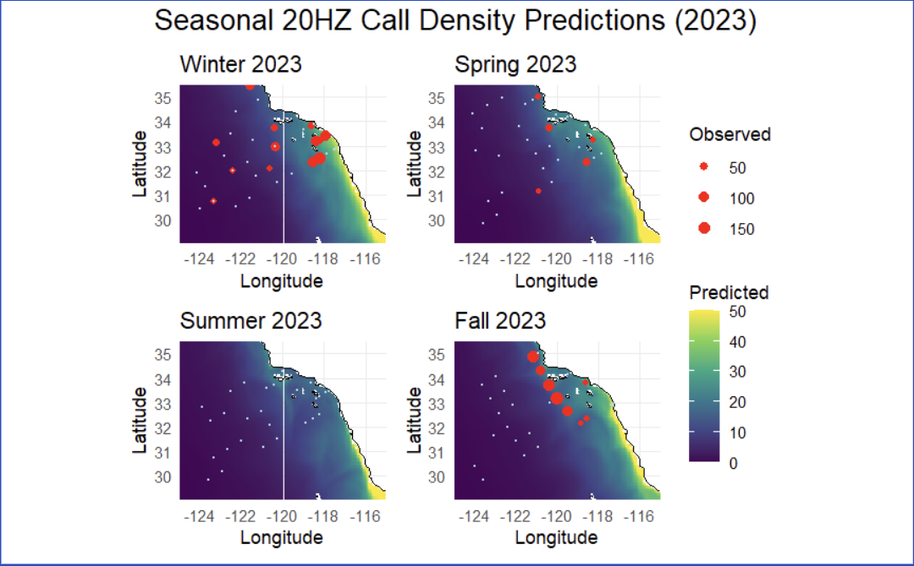

```{r setup, include=FALSE}
knitr::opts_chunk$set(echo = FALSE, message=FALSE, warning=FALSE, fold = TRUE, fig.align = "center", fig.pos = "H")
```

# Introduction

Researching the presence of blue and fin whales and their reliance on distinct call types for behaviors (such as foraging and reproduction) is important for monitoring ecosystem health and guiding conservation efforts in the California Current System. By analyzing their calls in relation with environmental data, we can gain insight into their behavioral patterns and habitat use across time.

Several foundational studies guided our research by providing us a solid background understanding on our topic. For example, Becker et al. (2022) studied how different whale species use habitat across the California Current and showed that it's important to use flexible models that can account for changes in space and time. Campbell et al. (2015) showed that there were long-term trends in whale sightings using CalCOFI visual survey data, while Oleson et al. (2007) and Širović et al. (2013) demonstrated that specific whale call types correlate with behavioral states, supporting our decision to model each call type separately.

The primary focus of our project was to create spatiotemporal species distribution models to predict the presence and non-presence of blue and fin whales in the Southern California Bight. We sought to understand the ways in which different environmental factors like sea surface temperature, water salinity, and ocean current affect cetacean acoustic presence. We quantify cetacean presence by detection of several different acoustic call types. Our call types include A, B, and D calls associated with blue whales, as well as 20 hertz and 40 hertz calls associated with fin whales. These calls are detected at numerous California Cooperative Oceanic Fisheries Investigations (CalCOFI) stations off the California coast and recorded during several research cruises conducted annually. By accurately predicting local fin and blue whale densities, we can better understand their migratory, foraging, and reproductive patterns-allowing us to shift conservation efforts and environmental policies accordingly.

**Github:** All work will be documented in the following GitHub repository:\
<https://github.com/Capstone-24-25/capstone-scripps>

## Datasets

### CASE-STSE

The CASE-STSE dataset collects oceanographic data over one- to three-month periods to generate detailed analyses and 30-day forecasts of ocean conditions. It includes observations from various sources, including underwater gliders, temperature probes, floating sensors, and satellites. The dataset includes three-dimensional fields of temperature, salinity, pressure, and velocity, making it a valuable resource for understanding dynamic ocean processes. More information and data products can be accessed at <https://ecco.ucsd.edu/case_stse_results1.html>.


Here is a visualization of sea surface temperature in the Southern California Bight.

### CalCoFI

The CalCoFI dataset contains data on whale detection across survey stations, comprising of visual surveys, acoustic recordings, and environmental DNA detections. The resulting data includes the number of individual calls and their types (or response variables), such as A, B, and D calls for blue whales, and A, B, D, 20 Hz and 40 Hz calls for fin whales. These response variables will tell us how environmental variables affects different whales/each individual call. Prior to conducting our project, we conducted exploratory data analysis to better understand this dataset.

{width=80% fig-align='center'}

Here is a visualization of CalCOFI station locations. A larger dot corresponds to more recording hours. 

\newpage

## Methodology 

**Preprocessing**
Using an adapted MATLAB script, we extracted relevant CASE-STSE variables and computed monthly cruise averages aligned with acoustic observations. The resulting dataset was indexed by year and month. Furthermore, we scaled all whale call types from CalCOFI by duration of sonobuoy deployment and projected latitude and longitude in kilometers.

We then integrated whale acoustic data with environmental variables to examine how environmental conditions influence whale acoustic presence across space and time in the Southern California Bight.

- Temporal Matching: Records from CalCOFI and CASE-STSE were joined by matching the common year-month field.

- Spatial Matching: For each CalCOFI observation, the nearest CASE-STSE grid cell with non NA value was identified using k-nearest neighbors on latitude and longitude coordinates.

**Feature Engineering**
We initially explored the relationships between whale call types and environmental predictors using `ggplot2`.

**Model Development**
We developed a spatiotemporal model using the `sdmTMB` package, which enables spatially explicit modeling with generalized linear mixed-effects frameworks. We selected a delta-gamma distribution to handle zero-inflated acoustic presence data and varied combinations of predictors, spatial mesh sizes, and parameters to optimize model performance.

**Evaluation**
Model performance was assessed using Root Mean Square Error (RMSE) and standard deviation of observed values to evaluate both accuracy and variability.


## Load Packages and Data

```{r, message = F, warning = F}
# Load in the libraries
library(tidyverse)
library(sdmTMB)
library(ggplot2)
library(readr)
library(ggcorrplot)
library(Metrics)
library(naniar)
library(tibble)
library(rsample)
library(caret)
library(purrr)
library(tune)
library(patchwork)
library(ggOceanMaps)
library(janitor)
library(sp)
library(sf)
library(rnaturalearth)
library(patchwork)

# Read in the data
cal_data <- read.csv("/Users/josh/Documents/GitHub/capstone-scripps/data/Merged_CalCOFI/merged_std_data_05_13_25.csv")
```

## Data Cleaning

By the nature of ecological data sets, much of the data is either NA or 0. Of the 4204 observations in the full data set, only 1035 are non NA values, and only 243 of those are non 0. To account for this there will be 1 data set for modeling with all NA values removed, and 1 data set for exploratory data analysis with all 0's removed.

```{r}
# Removing the first two columns
cal_data <- cal_data[, -c(1,2)]

# Changing dataset to only have present response data
cal_data <- cal_data %>% 
  filter(!is.na(x20hz_scaled))

# Remove calls with a value of 0
cal_data_cleaned <- cal_data %>%
  filter(x20hz_scaled != 0)
```

## Exploratory Data Analysis

### Correlation Plot

```{r}
# Plotting Correlation
# Define expected columns
cols_to_use <- c("est_depth", 
                 "temperature_depth_105", "temperature_depth_280", "temperature_depth_55", 
                 "salinity_depth_105", "salinity_depth_280", "salinity_depth_55", 
                 "meridional_velocity_depth_105", "meridional_velocity_depth_280", "meridional_velocity_depth_55", 
                 "zonal_velocity_depth_105", "zonal_velocity_depth_280", "zonal_velocity_depth_55", 
                 "vertical_velocity_depth_105", "vertical_velocity_depth_280", "vertical_velocity_55", "lon", "lat", "season")

# Keep only existing columns
existing_cols <- intersect(cols_to_use, colnames(cal_data))
cor_data <- cal_data[, existing_cols, drop = FALSE]

# Compute correlation matrix (use complete.obs to skip missing data)
cor_matrix <- cor(cor_data, use = "complete.obs")

# Correlation plot
ggcorrplot(cor_matrix, 
           lab = TRUE, 
           hc.order = TRUE, 
           lab_size =2,
           tl.cex = 5,
           type = "lower", 
           title = "Correlation Plot")
```
First we will explore into the collinearity of our variables, as having linearly dependent predictors will cause problems in our modeling. Darker red or blue values correspond to a stronger positive or negative correlation, respectively. Observing our correlation matrix, we see that several of the salinity predictors are perfectly positively correlated, several of the velocities are perfectly or nearly perfectly correlated, and a few of the temperature values are also highly positively correlated. This makes sense as a depth of 55 meters and a depth of 105 meters really isn't all that different, causing these variables to be effectively the same from a modeling stand point. As for negative correlations, the only notable correlation is between longitude and estimated depth. This makes perfect sense as ocean depth will get significantly deeper as longitude moves away from the coast. In the future, models will become computationally sungular if the predictor combinations have too much collinearity.

```{r, eval = FALSE}
# Create the main scatter plot
p_season_main <- ggplot(cal_data_cleaned, aes(x = season, y = x20hz_scaled)) +
  geom_point() +
  geom_smooth(method = "lm") +
  theme_classic() +
  labs(
    x = "Season (Years)",
    y = "20 Hz Call Counts (scaled)"
  )

# Create the histogram for the x-axis
p_season_hist_x <- ggplot(cal_data_cleaned, aes(x = season)) + 
  geom_histogram(fill = "gray", color = "black") +
  theme_void() +
  theme(axis.text.x = element_blank(), 
        axis.ticks.x = element_blank())

# Combine with patchwork
p_season_hist_x / p_season_main
```

### Spatiotemporal Visualization of A Call Detections

The following visualization shows the count of observed 20 Hz calls from the years 2012 - 2023 across the Southern California Bight. It is represented across binned seasons and years with specified spatial coordinates.

```{r, fig.width = 6, fig.height = 8}
# Define season labels for facet
season_labels <- c(
  "0" = "Winter",
  "0.25" = "Spring",
  "0.5" = "Summer",
  "0.75" = "Fall"
)

basemap(data = cal_data_cleaned, bathymetry = TRUE) + 
  geom_point(data = cal_data_cleaned, aes(x = lon, y = lat, color = x20hz_scaled), size = 1) +
  scale_color_gradient(low = "yellow", high = "red", limits = c(0, 23)) +
  labs(
    title = "20 Hz Call Observations Through Space and Time", 
    x = "Longitude", y = "Latitude", 
    color = "Observed Whale Call Number"
  ) +
  theme_minimal() +
  theme(axis.text.x = element_text(size = 3)) +
  facet_grid(
    rows = vars(year),
    cols = vars(season_decimal),
    labeller = labeller(season_decimal = season_labels)
  )
```

From these visuals, we can see that fin whales produce their 20 Hz call most often in the fall and winter months. Since the fin whale 20 Hz call corresponds to reproductive behaviors, and fin whales reproduce in the winter months, these visuals perform as expected.

## Splitting the Data

```{r}
# Split data into training and testing sets with most recent year as our testing set
set.seed(123)
last_year <- max(cal_data$year)
train_data <- cal_data %>% filter(year != last_year)
test_data <- cal_data %>% filter(year == last_year)
```

As is standard practice, the data has been split into training and testing sets, one to train models on and one to test model performance. As the data is organized chronologically, the testing set is only the most recent year of collected data, 2023. The training set is all other years of observations, 2012-2022.

## Modeling

The sdmTMB package provides a framework for a spatiotemporal general linear mixed model with many different model specifications available. Other than which predictors to include, important arguments include time, family, and spatiotemporal. Time = season allows the model to increment over different seasons. Since whale call behavior changes more from season to season than they do month to month or year to year, season is the most appropriate time increment. Family = delta_gamma is used to deal with the highly 0 inflated dataset. It combines a logit model to predict whether the response is 0 or non 0 with a log model to predict the magnitude of positive values. Lastly for the spatiotemporal argument, iid or "independent identically distributed" assumes there is no relation between current and previous seasons, rw or "random walk" assumes each season is dependent upon the last one, and ar1 or "autoregressive" is a slight variation on rw which varies the strength of correlation between seasons. 

First, here is a fit sdmTMB model with only the intercept as a predictor, but varying spatiotemporal between iid, rw and ar1. 

```{r, eval=FALSE}
# Create mesh using training data
mesh_train <- make_mesh(train_data,
                        xy_cols = c("X", "Y"),
                        cutoff = 5)

# Fit spatiotemporal model
fit_spatiotemporal <- sdmTMB(
  x20hz_scaled ~ 1,  
  data = train_data, 
  mesh = mesh_train,
  time = "season",
  family = delta_gamma(link1 = "logit", link2 = "log"),
  spatial = "on", 
  spatiotemporal = "ar1",
  extra_time = unique(test_data$season)
)

# Predictions on training and test data
training_pred <- predict(fit_spatiotemporal, newdata = train_data, type = "response")
training_pred$observed <- train_data$x20hz_scaled

test_pred <- predict(fit_spatiotemporal, newdata = test_data, type = "response")
test_pred$observed <- test_data$x20hz_scaled

# Compute RMSE
rmse_train <- rmse(training_pred$observed, training_pred$est)
rmse_test <- rmse(test_pred$observed, test_pred$est)

# Compute Range
range_train <- range(train_data$x20hz_scaled, na.rm = TRUE)
range_test <- range(test_data$x20hz_scaled, na.rm = TRUE)

# Compute Standard Deviation
sd_train <- sd(train_data$x20hz_scaled, na.rm = TRUE)
sd_test <- sd(test_data$x20hz_scaled, na.rm = TRUE)

# Assemble the table
summary_table_1 <- data.frame(
  Dataset = c("Training", "Test"),
  RMSE = c(rmse_train, rmse_test),
  Range_Min = c(range_train[1], range_test[1]),
  Range_Max = c(range_train[2], range_test[2]),
  Std_Dev = c(sd_train, sd_test)
)

saveRDS(summary_table_1, file = "20_Hz_Report_Materials/summary_table_1.rds")

```
### AR1

```{r}
# Load the summary table back in
summary_table_1 <- readRDS("20_Hz_Report_Materials/summary_table_1.rds")

# Print the summary table
print(summary_table_1)
```

```{r, eval=FALSE}
# Create mesh using training data
mesh_train <- make_mesh(train_data,
                        xy_cols = c("X", "Y"),
                        cutoff = 5)

# Fit spatiotemporal model
fit_spatiotemporal <- sdmTMB(
  x20hz_scaled ~ 1,  
  data = train_data, 
  mesh = mesh_train,
  time = "season",
  family = delta_gamma(link1 = "logit", link2 = "log"),
  spatial = "on", 
  spatiotemporal = "iid",
  extra_time = unique(test_data$season)
)

# Predictions on training and test data
training_pred <- predict(fit_spatiotemporal, newdata = train_data, type = "response")
training_pred$observed <- train_data$x20hz_scaled

test_pred <- predict(fit_spatiotemporal, newdata = test_data, type = "response")
test_pred$observed <- test_data$x20hz_scaled

# Compute RMSE
rmse_train <- rmse(training_pred$observed, training_pred$est)
rmse_test <- rmse(test_pred$observed, test_pred$est)

# Compute Range
range_train <- range(train_data$x20hz_scaled, na.rm = TRUE)
range_test <- range(test_data$x20hz_scaled, na.rm = TRUE)

# Compute Standard Deviation
sd_train <- sd(train_data$x20hz_scaled, na.rm = TRUE)
sd_test <- sd(test_data$x20hz_scaled, na.rm = TRUE)

# Assemble the table
summary_table_2 <- data.frame(
  Dataset = c("Training", "Test"),
  RMSE = c(rmse_train, rmse_test),
  Range_Min = c(range_train[1], range_test[1]),
  Range_Max = c(range_train[2], range_test[2]),
  Std_Dev = c(sd_train, sd_test)
)

saveRDS(summary_table_2, file = "20_Hz_Report_Materials/summary_table_2.rds")

```
### IID

```{r}
# Load the summary table back in
summary_table_2 <- readRDS("20_Hz_Report_Materials/summary_table_2.rds")

# Print the summary table
print(summary_table_2)
```

```{r, eval=FALSE}
# Create mesh using training data
mesh_train <- make_mesh(train_data,
                        xy_cols = c("X", "Y"),
                        cutoff = 5)

# Fit spatiotemporal model
fit_spatiotemporal <- sdmTMB(
  x20hz_scaled ~ 1,  
  data = train_data, 
  mesh = mesh_train,
  time = "season",
  family = delta_gamma(link1 = "logit", link2 = "log"),
  spatial = "on", 
  spatiotemporal = "rw",
  extra_time = unique(test_data$season)
)

# Predictions on training and test data
training_pred <- predict(fit_spatiotemporal, newdata = train_data, type = "response")
training_pred$observed <- train_data$x20hz_scaled

test_pred <- predict(fit_spatiotemporal, newdata = test_data, type = "response")
test_pred$observed <- test_data$x20hz_scaled

# Compute RMSE
rmse_train <- rmse(training_pred$observed, training_pred$est)
rmse_test <- rmse(test_pred$observed, test_pred$est)

# Compute Range
range_train <- range(train_data$x20hz_scaled, na.rm = TRUE)
range_test <- range(test_data$x20hz_scaled, na.rm = TRUE)

# Compute Standard Deviation
sd_train <- sd(train_data$x20hz_scaled, na.rm = TRUE)
sd_test <- sd(test_data$x20hz_scaled, na.rm = TRUE)

# Assemble the table
summary_table_3 <- data.frame(
  Dataset = c("Training", "Test"),
  RMSE = c(rmse_train, rmse_test),
  Range_Min = c(range_train[1], range_test[1]),
  Range_Max = c(range_train[2], range_test[2]),
  Std_Dev = c(sd_train, sd_test)
)

saveRDS(summary_table_3, file = "20_Hz_Report_Materials/summary_table_3.rds")
```

### RW

```{r}
# Load the summary table back in
summary_table_3 <- readRDS("20_Hz_Report_Materials/summary_table_3.rds")

# Print the summary table
print(summary_table_3)
```

Using only the intercept as a predictor we find that a random walk performs best by a small margin. Here the Test RMSE = 30.529 with the Test Standard Deviation = 32.809. Signs of success for these models is having the RMSE lower than the STD DEV, aiming to have RMSE/STD DEV as close to 0 as possible. While random walk performs best with only the intercept, as more complexity is introduced to the model, the ability to have varying dependencies between seasons will begin to perform slightly better. Due to this, all further models will be with spatiotemporal = ar1.

### Modeling with Predictors

Introducing non intercept predictors to the sdmTMB models helps to improve their predictive power. As mentioned previously, many predictors had varying levels of collinearity and as such, many predictors combinations were not usable. Oftentimes models would be "computationally singular" and would throw errors before finishing their fitting. All models discussed here are not computationally singular. One good strategy for avoiding this issue was by using predictors only at a specific depth.

Notable models include:

x20hz_scaled ~ temperature_depth_55_std + theta_depth_55_std,

which was found to be the best predictive pair at depth 55. Depth 55 was also the best predictive depth. Using splines on predictors was another technique used to try and improve the predictive power of the models.

```{r, eval = FALSE}
# Create mesh using training data
mesh_train <- make_mesh(train_data,
                        xy_cols = c("X", "Y"),
                        cutoff = 5)

fit_spatiotemporal <- sdmTMB(
  x20hz_scaled ~ temperature_depth_55_std + theta_depth_55_std,  
  data = train_data, 
  mesh = mesh_train,
  time = "season",
  family = delta_gamma(link1 = "logit", link2 = "log"),
  spatial = "on", 
  spatiotemporal = "ar1",
  extra_time = unique(test_data$season)
)

# Predictions on training and test data
training_pred <- predict(fit_spatiotemporal, newdata = train_data, type = "response")
training_pred$observed <- train_data$x20hz_scaled

test_pred <- predict(fit_spatiotemporal, newdata = test_data, type = "response")
test_pred$observed <- test_data$x20hz_scaled

# Compute RMSE
rmse_train <- rmse(training_pred$observed, training_pred$est)
rmse_test <- rmse(test_pred$observed, test_pred$est)

# Compute Range
range_train <- range(train_data$x20hz_scaled, na.rm = TRUE)
range_test <- range(test_data$x20hz_scaled, na.rm = TRUE)

# Compute Standard Deviation
sd_train <- sd(train_data$x20hz_scaled, na.rm = TRUE)
sd_test <- sd(test_data$x20hz_scaled, na.rm = TRUE)

# Assemble the table
summary_table_5 <- data.frame(
  Dataset = c("Training", "Test"),
  RMSE = c(rmse_train, rmse_test),
  Range_Min = c(range_train[1], range_test[1]),
  Range_Max = c(range_train[2], range_test[2]),
  Std_Dev = c(sd_train, sd_test)
)

saveRDS(summary_table_5, file = "20_Hz_Report_Materials/summary_table_5.rds")
```

### x20hz_scaled ~ temperature_depth_55_std + theta_depth_55_std

```{r}
# Load the summary table back in
summary_table_5 <- readRDS("20_Hz_Report_Materials/summary_table_4.rds")

# Print the summary table
print(summary_table_5)
```

```{r, eval = FALSE}
# Create mesh using training data
mesh_train <- make_mesh(train_data,
                        xy_cols = c("X", "Y"),
                        cutoff = 5)

fit_spatiotemporal <- sdmTMB(
  x20hz_scaled ~ s(temperature_depth_55_std) + s(theta_depth_55_std),  
  data = train_data, 
  mesh = mesh_train,
  time = "season",
  family = delta_gamma(link1 = "logit", link2 = "log"),
  spatial = "on", 
  spatiotemporal = "ar1",
  extra_time = unique(test_data$season)
)

# Predictions on training and test data
training_pred <- predict(fit_spatiotemporal, newdata = train_data, type = "response")
training_pred$observed <- train_data$x20hz_scaled

test_pred <- predict(fit_spatiotemporal, newdata = test_data, type = "response")
test_pred$observed <- test_data$x20hz_scaled

# Compute RMSE
rmse_train <- rmse(training_pred$observed, training_pred$est)
rmse_test <- rmse(test_pred$observed, test_pred$est)

# Compute Range
range_train <- range(train_data$x20hz_scaled, na.rm = TRUE)
range_test <- range(test_data$x20hz_scaled, na.rm = TRUE)

# Compute Standard Deviation
sd_train <- sd(train_data$x20hz_scaled, na.rm = TRUE)
sd_test <- sd(test_data$x20hz_scaled, na.rm = TRUE)

# Assemble the table
summary_table_6 <- data.frame(
  Dataset = c("Training", "Test"),
  RMSE = c(rmse_train, rmse_test),
  Range_Min = c(range_train[1], range_test[1]),
  Range_Max = c(range_train[2], range_test[2]),
  Std_Dev = c(sd_train, sd_test)
)

saveRDS(summary_table_6, file = "20_Hz_Report_Materials/summary_table_5.rds")
```

### x20hz_scaled ~ s(temperature_depth_55_std) + s(theta_depth_55_std)

```{r}
# Load the summary table back in
summary_table_6 <- readRDS("20_Hz_Report_Materials/summary_table_4.rds")

# Print the summary table
print(summary_table_6)
```

Unfortunately, using splines did not tend to help model performance. In the case of x20hz_scaled ~ temperature_depth_55_std + theta_depth_55_std, using splines actually didn't change anything at all. This sentiment was reflected throughout the modeling process as splined models did not show significant improvement over non-splined models. In fact, in certain scenarios, splines caused predictor combinations to become computationally singular when the non-splined version was able to fit without issues. Because of this, splines were mostly ruled out.

## Best Model

After much exploration through many many iterations of different modeling combinations, the model which best predicts 20 Hz fin whales calls based on static environmental factors is an AR1 model with time = season, family = delta_gamma(link1 = "logit", link2 = "log") and a predictor set of 

x20hz_scaled ~ temperature_depth_105_std + temperature_depth_55_std + temperature_depth_280_std + salinity_depth_55_std + salinity_depth_105_std + magnitude_depth_55_std + magnitude_depth_105_std + theta_depth_55_std + theta_depth_105_std.


```{r, eval=FALSE}
# Create mesh using training data
mesh_train <- make_mesh(train_data,
                        xy_cols = c("X", "Y"),
                        cutoff = 5)

# Fit spatiotemporal model
fit_spatiotemporal <- sdmTMB(
  x20hz_scaled ~ temperature_depth_105_std + temperature_depth_55_std + temperature_depth_280_std + salinity_depth_55_std + salinity_depth_105_std + magnitude_depth_55_std + magnitude_depth_105_std + theta_depth_55_std + theta_depth_105_std,  
  data = train_data, 
  mesh = mesh_train,
  time = "season",
  family = delta_gamma(link1 = "logit", link2 = "log"),
  spatial = "on", 
  spatiotemporal = "ar1",
  extra_time = unique(test_data$season)
)

# Predictions on training and test data
training_pred <- predict(fit_spatiotemporal, newdata = train_data, type = "response")
training_pred$observed <- train_data$x20hz_scaled

test_pred <- predict(fit_spatiotemporal, newdata = test_data, type = "response")
test_pred$observed <- test_data$x20hz_scaled

# Compute RMSE
rmse_train <- rmse(training_pred$observed, training_pred$est)
rmse_test <- rmse(test_pred$observed, test_pred$est)

# Compute Range
range_train <- range(train_data$x20hz_scaled, na.rm = TRUE)
range_test <- range(test_data$x20hz_scaled, na.rm = TRUE)

# Compute Standard Deviation
sd_train <- sd(train_data$x20hz_scaled, na.rm = TRUE)
sd_test <- sd(test_data$x20hz_scaled, na.rm = TRUE)

# Assemble the table
summary_table_4 <- data.frame(
  Dataset = c("Training", "Test"),
  RMSE = c(rmse_train, rmse_test),
  Range_Min = c(range_train[1], range_test[1]),
  Range_Max = c(range_train[2], range_test[2]),
  Std_Dev = c(sd_train, sd_test)
)

saveRDS(summary_table_4, file = "20_Hz_Report_Materials/summary_table_4.rds")
```

```{r}
# Load the summary table back in
summary_table_4 <- readRDS("20_Hz_Report_Materials/summary_table_4.rds")

# Print the summary table
print(summary_table_4)
```

Here the test RMSE = 30.145 and Test Standard Deviation = 32.809 for a RMSE to STD DEV ratio of .918.


Here is a visual of predicted vs observed calls. The colors filling the ocean describe the amount of predicted calls with a lighter color corresponding to more predicted calls and a darker color meaning less. The red dots articulate the locations of observed whale calls with a larger dot indicating more observed calls. Signs of success in these figures is seeing red and yellow overlapping. During the fall and winter, the model does decently well to predict call presence near to the cast, indicating a learned spatial relation. However, the frequency of predicted calls is not quite accurate with the largest number of predicted calls only reaching 50, and the largest number of observed calls reaching 150.

# Conclusion

In conclusion, the 20 Hz model does alright trying to predict whale acoustic presence. The ratio of RMSE to STD DEV is less than 1, indicating that this model does better than simply predicting the mean value. This shows that the model has learned to predict 20 Hz calls to some degree, even if it does not perform terrifically. However, looking at this from a behavioral standpoint, the results definitely make sense. Assume for a second that someone was trying to predict whether or not their friend was having a good day only based on what day it was, the weather outside, and what they ate for breakfast. While they might do decently, recognizing that people are more happy on weekends, that sunny days likely correspond to higher spirits, and a good healthy breakfast sets people up well for the rest of their day, this prediction method misses out on so many other important factors. This theoretical model wouldn't know whether or not someone had gotten into a car accident earlier that day, or if their significant other had just broken up with them, or any other number of outside factors not captured by 3 static predictors. This is exactly the case with fin whale calls. The 20 Hz call is a reproductive social act which likely is highly dependent upon many things this model does not capture. Things like mating patterns or food abundance or presence of other whales. All of these, and much more are likely highly influential on whether or not fin whales make their 20 Hz call. Unfortunately, only modeling on static ocean conditions misses out on much of the story. Future work trying to improve this model woud likely need to incorporate more predictors which capture information about whale's social agendas rather than just outside impacts.
