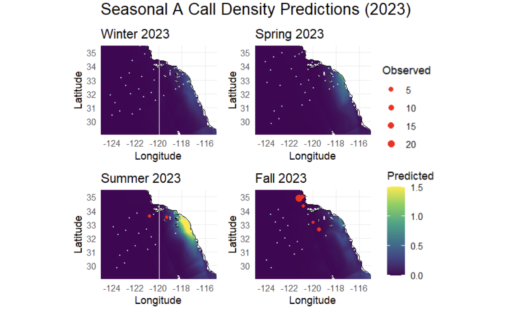

```{r setup, include=FALSE}
knitr::opts_chunk$set(
  echo = FALSE,
  message = FALSE,
  warning = FALSE,
  fig.align = "center"
)
```

```{r, message = F, warning = F}
# Load in the libraries
library(tidyverse)
library(sdmTMB)
library(ggplot2)
library(readr)
library(ggcorrplot)
library(Metrics)
library(naniar)
library(tibble)
library(rsample)
library(caret)
library(purrr)
library(tune)
library(patchwork)
library(ggOceanMaps)

# Read in the data
cal_data <- read.csv("../../data/Merged_CalCOFI/merged_std_data_05_13_25.csv")

# Removing the first two columns
cal_data <- cal_data[, -c(1,2)]

# Changing dataset to only have present response data
cal_data <- cal_data %>% 
  filter(!is.na(a_scaled))
```

## Abstract

This study investigates the spatiotemporal distribution of blue whale A calls in the Southern California Bight using environmental and acoustic data from 2012 to 2023. A calls, which are associated with year-round reproductive behavior, were modeled using a generalized linear mixed model (GLMM) with spatial and temporal components. The final model incorporated temperature at 55 meters depth, latitude, and longitude as predictors, and was evaluated using root mean square error (RMSE) and visual alignment with observed detections. Although the model yielded a low test RMSE (1.9812), it failed to accurately predict seasonal trends and hotspots of call activity—suggesting limitations of using environmental variables alone to explain reproductive vocalizations. Predicted call densities peaked in summer, whereas observed detections were highest in fall, highlighting a spatial and seasonal mismatch. These results suggest that additional ecological drivers or greater sampling resolution may be necessary to more accurately model reproductive acoustic behavior in blue whales.

## Introduction

Blue whale A calls are long, low-frequency vocalizations thought to be associated with reproductive behavior occurring year-round (Oleson et al., 2007). Understanding where and when these calls occur can provide critical insights into local blue whale population dynamics, habitat use, and reproductive activity. In this study, we focus exclusively on modeling the presence and density of blue whale A calls in the Southern California Bight using data from the California Cooperative Oceanic Fisheries Investigations (CalCOFI) and the CASE-STSE oceanographic dataset.

## Datasets

This study uses two primary data sources to examine the distribution of blue whale A calls in the Southern California Bight: passive acoustic monitoring data from the California Cooperative Oceanic Fisheries Investigations (CalCOFI) and oceanographic data from the CASE-STSE project. CalCOFI has conducted quarterly oceanographic surveys since 1949 to monitor long-term changes in marine ecosystems. Since 2004, these surveys have included the use of drifting sonobuoys equipped with hydrophones to detect marine mammal vocalizations. Sonobuoys are deployed at fixed stations arranged along standard transects that extend from nearshore to offshore, typically recording for one to eight hours per deployment depending on ship time at station.

The acoustic data used in this study include detections from sonobuoy deployments conducted between 2012 and 2023. These recordings were processed to classify five types of whale vocalizations, including blue whale A, B, and D calls. Detection efforts focused on the 10–150 Hz frequency band, which captures the low-frequency vocal behavior of baleen whales. An automated detection pipeline, informed by machine learning and manual validation, was used to generate the final call detections. These detections were then summarized by station and survey to create an acoustic presence dataset of counts of call types, with a focus in this study on the blue whale A call.

Environmental predictor data was obtained from the CASE-STSE dataset, which contains high-resolution oceanographic measurements collected from gliders, probes, floating sensors, and satellites. The dataset includes monthly averages for variables such as temperature, salinity, current speed, and current direction at three depth levels: 55 meters, 105 meters, and 280 meters. Each observation is associated with spatial coordinates and a specific year-month index. Together, these two datasets provide a foundation for examining the environmental drivers of blue whale A call presence.

## Methodology

To investigate the spatial and temporal distribution of blue whale A calls, we developed a species distribution model using a spatiotemporal generalized linear mixed modeling framework. The merged dataset, which combined frequency of acoustic detections and environmental variables, was structured by month and location. We used the sdmTMB package in R to construct models capable of helping combat spatial autocorrelation and zero-inflated response data. A delta-gamma distribution was applied to handle the excess zeros commonly found in acoustic presence datasets. Multiple combinations of environmental predictors and spatial mesh resolutions were tested to identify the model with the best predictive performance. Model evaluation was based on root mean square error (RMSE) and visual comparison of predicted call densities to observed detections across seasons.

## Exploratory Data Analysis

### Relationship Between Predictors and Call Responses

Ecological data is naturally zero-inflated. Before examining the relationship between A call detection counts and various predictors, it is imperative to remove any values that contain 0 to get a true understanding of the data.

```{r}
# Duplicate the dataframe
cal_data_cleaned <- cal_data

# Remove A calls with a value of 0
cal_data_cleaned <- cal_data_cleaned %>%
  filter(a_scaled != 0)
```

#### A Calls vs. Longitude

```{r}
# Create the main scatter plot
p_lon_main <- ggplot(cal_data_cleaned, aes(x = lon, y = a_scaled)) +
  geom_point() +
  geom_smooth(method = "lm") +
  theme_classic() +
  labs(
    x = "Longitude",
    y = "A Call Counts (scaled)"
  )

# Create the histogram for the x-axis
p_lon_hist_x <- ggplot(cal_data_cleaned, aes(x = lon)) + 
  geom_histogram(fill = "gray", color = "black") +
  theme_void() +
  theme(axis.text.x = element_blank(), 
        axis.ticks.x = element_blank())

# Combine with patchwork
p_lon_hist_x / p_lon_main
```

The histogram shows the frequency of A call detection across different longitude values. There are notable peaks of calls around longitudes -121, -120, and -118.25. This could potentially indicate that these are the areas where blue whales are more active. Additionally, it could indicate migratory paths or feeding grounds along these longitudes.

The scatter plot maps each detection event to a specific longitude. The flat linear regression line suggests that there is no clear linear trend in the number of blue whale calls as longitude changes. However, the spread of data points suggests that while some regions are more densely populated with detections, the relationship is non-linear.

#### A Calls vs. Latitude

```{r}
# Create the main scatter plot
p_lat_main <- ggplot(cal_data_cleaned, aes(x = lat, y = a_scaled)) +
  geom_point() +
  geom_smooth(method = "lm") +
  theme_classic() +
  labs(
    x = "Latitude",
    y = "A Call Counts (scaled)"
  )

# Create the histogram for the x-axis
p_lat_hist_x <- ggplot(cal_data_cleaned, aes(x = lat)) + 
  geom_histogram(fill = "gray", color = "black") +
  theme_void() +
  theme(axis.text.x = element_blank(), 
        axis.ticks.x = element_blank())
# Combine with patchwork
p_lat_hist_x / p_lat_main
```

The histogram represents the frequency of A call detections across different latitudes in the dataset. There are clear peaks around \~32.5. These peaks suggest that A calls are more frequently detected in those specific latitude bands. This could indicate preferred migration paths, feeding grounds, or congregation areas.

The scatter plot maps latitude against the number of A calls detected. There is a slight positive trend, suggesting that as latitude increases, the count of blue whales increase. However, the trend is still weak, as indicated by the broad confidence interval.

#### A Calls vs. Season

```{r}
# Create the main scatter plot
p_season_main <- ggplot(cal_data_cleaned, aes(x = season, y = a_scaled)) +
  geom_point() +
  geom_smooth(method = "lm") +
  theme_classic() +
  labs(
    x = "Season (Years)",
    y = "A Call Counts (scaled)"
  )

# Create the histogram for the x-axis
p_season_hist_x <- ggplot(cal_data_cleaned, aes(x = season)) + 
  geom_histogram(fill = "gray", color = "black") +
  theme_void() +
  theme(axis.text.x = element_blank(), 
        axis.ticks.x = element_blank())

# Combine with patchwork
p_season_hist_x / p_season_main
```

The histogram represents the frequency of A call detections across different seasons (years). High detection rates are evident around 2012. It is a strong spike, suggesting a high occurrence or increased monitoring. 2016-2017 shows another increase in detections. Additionally, between 2023 to 2024 shows a rise of detection rates toward the end. Low detection rates are visible between 2013 to 2015. Further, early 2020s also show low numbers, which is likely attributed to the lack of monitoring during the COVID-19 pandemic.

The scatter plot maps season against A call counts. There is a slight positive slope, indicating that detections of A calls have been slightly increasing over time. The confidence interval is quite large, reflecting high variability and less certainty in the trend. Notably, in 2012, 2016, and 2023, there are a few large spikes, which may represent unusually high activity or increased monitoring efforts.

#### A Calls vs. Temperature at Depth 55

```{r}
# Create the main scatter plot
p_temp_55_main <- ggplot(cal_data_cleaned, aes(x = temperature_depth_55, y = a_scaled)) +
  geom_point() +
  geom_smooth(method = "lm") +
  theme_classic() +
  labs(
    x = "Temperature (Celcius) at Depth 55",
    y = "A Call Counts (scaled)"
  )

# Create the histogram for the x-axis
p_temp_55_hist_x <- ggplot(cal_data_cleaned, aes(x = temperature_depth_55)) + 
  geom_histogram(fill = "gray", color = "black") +
  theme_void() +
  theme(axis.text.x = element_blank(), 
        axis.ticks.x = element_blank())

# Combine with patchwork
p_temp_55_hist_x / p_temp_55_main
```

The histogram represents the frequency of A call detections across the distribution of water temperatures at 55m depth. There is a strong concentration between 15.5 and 19 degrees, indicating that most blue whales fall within this range. Sparse readings below 15 degrees and above 19 degrees suggests that those temperatures are less ideal for blue whales.

The scatter plot maps temperature at 55m depth against the number of A calls detected. The slope of the linear regression fit is almost flat, suggesting that the temperature at 55m depth does not have significant linear relationship with the number of A calls. Further, the confidence interval is relatively wide, reflecting high variability in the data.

#### A Calls vs. Temperature at Depth 105

```{r}
# Create the main scatter plot
p_temp_105_main <- ggplot(cal_data_cleaned, aes(x = temperature_depth_105, y = a_scaled)) +
  geom_point() +
  geom_smooth(method = "lm") +
  theme_classic() +
  labs(
    x = "Temperature (Celcius) at Depth 105",
    y = "A Call Counts (scaled)"
  )

# Create the histogram for the x-axis
p_temp_105_hist_x <- ggplot(cal_data_cleaned, aes(x = temperature_depth_105)) + 
  geom_histogram(fill = "gray", color = "black") +
  theme_void() +
  theme(axis.text.x = element_blank(), 
        axis.ticks.x = element_blank())

# Combine with patchwork
p_temp_105_hist_x / p_temp_105_main
```

The histogram represents the frequency of A call detections across the distribution of water temperatures at 105m depth. There is a strong concentration between 15 and 19 degrees, indicating that most blue whales fall within this temperature range. Sparse readings below 15 degrees and above 19 degrees suggests that those temperatures are less ideal for blue whales for this depth.

The scatter plot maps temperature at 105m depth against the number of A calls detected. The slope of the linear regression fit is almost flat, suggesting that the temperature at 105m depth does not have significant linear relationship with the number of A calls. Further, the confidence interval is relatively wide, reflecting high variability in the data.

#### A Calls vs. Temperature at Depth 280

```{r}
# Create the main scatter plot
p_temp_280_main <- ggplot(cal_data_cleaned, aes(x = temperature_depth_280, y = a_scaled)) +
  geom_point() +
  geom_smooth(method = "lm") +
  theme_classic() +
  labs(
    x = "Temperature (Celcius) at Depth 280",
    y = "A Call Counts (scaled)"
  )

# Create the histogram for the x-axis
p_temp_280_hist_x <- ggplot(cal_data_cleaned, aes(x = temperature_depth_280)) + 
  geom_histogram(fill = "gray", color = "black") +
  theme_void() +
  theme(axis.text.x = element_blank(), 
        axis.ticks.x = element_blank())

# Combine with patchwork
p_temp_280_hist_x / p_temp_280_main
```

The histogram represents the frequency of A call detections across the distribution of water temperatures at 280m depth. The distribution shows a large concentration of A calls between temperatures of 13 degrees and 18 degrees. Sparse occurrences below 12 degrees and above 19. The peak is at around 15.5 degrees, which might suggest that this is the most common deep-water temperature range where detections were recorded. However, the data points are spread widely.

The scatter plot maps temperature at 280m depth against the number of A calls detected. The linear regression fit is almost flat, with a slight negative slope. This suggests that temperature at 280m depth does not significantly correlate with the number of A calls. There is high variability in the scatter, as shown by the wide confidence interval.

#### A Calls vs. Salinity at Depth 55

```{r}
# Create the main scatter plot
p_sal_55_main <- ggplot(cal_data_cleaned, aes(x = salinity_depth_55, y = a_scaled)) +
  geom_point() +
  geom_smooth(method = "lm") +
  theme_classic() +
  labs(
    x = "Salinity (PSU) at Depth 55",
    y = "A Call Counts (scaled)"
  )

# Create the histogram for the x-axis
p_sal_55_hist_x <- ggplot(cal_data_cleaned, aes(x = salinity_depth_55)) + 
  geom_histogram(fill = "gray", color = "black") +
  theme_void() +
  theme(axis.text.x = element_blank(), 
        axis.ticks.x = element_blank())

# Combine with patchwork
p_sal_55_hist_x / p_sal_55_main
```

The histogram represents the frequency of A calls across the distribution of salinity values at 55m depth. The distribution is bimodal, with peaks at 33.45 and 33.5 PSU. However, the observations are fairly spread with high variability. Very few samples fall between 33.2 to 33.25 and 33.65 to 33.7.

The scatter plot maps salinity at 55m depth against the number of A calls detected. The slope of the linear regression fit is slightly negative, indicating a minor decrease in A calls as salinity increases. The trend is not very strong, but the slope suggests that lower salinity at 55m might be slightly more favorable for A call vocalizations. The confidence interval is wide, implying high variability in the scatter.

#### A Calls vs. Salinity at Depth 105

```{r}
# Create the main scatter plot
p_sal_105_main <- ggplot(cal_data_cleaned, aes(x = salinity_depth_105, y = a_scaled)) +
  geom_point() +
  geom_smooth(method = "lm") +
  theme_classic() +
  labs(
    x = "Salinity (PSU) at Depth 105",
    y = "A Call Counts (scaled)"
  )

# Create the histogram for the x-axis
p_sal_105_hist_x <- ggplot(cal_data_cleaned, aes(x = salinity_depth_105)) + 
  geom_histogram(fill = "gray", color = "black") +
  theme_void() +
  theme(axis.text.x = element_blank(), 
        axis.ticks.x = element_blank())

# Combine with patchwork
p_sal_105_hist_x / p_sal_105_main
```

The histogram represents the frequency of A calls across the distribution of salinity values at 105m depth. The distribution is fairly normal and clustered around 33.35 to 33.6 PSU with most A calls occurring within that range. There is a noticeable peak at 33.41 and 33.48 PSU.

The scatter plot maps salinity at 105m depth against the number of A calls detected. The slope of the linear regression fit is slightly negative, indicating a minor decrease in A calls as salinity increases at depth 105m. The trend is not very strong, but the slope suggests that lower salinity at 105m might be slightly more favorable for A call vocalizations. The confidence interval is wide, implying high variability in the scatter.

#### A Calls vs. Salinity at Depth 280

```{r}
# Create the main scatter plot
p_sal_280_main <- ggplot(cal_data_cleaned, aes(x = salinity_depth_280, y = a_scaled)) +
  geom_point() +
  geom_smooth(method = "lm") +
  theme_classic() +
  labs(
    x = "Salinity (PSU) at Depth 280",
    y = "A Call Counts (scaled)"
  )

# Create the histogram for the x-axis
p_sal_280_hist_x <- ggplot(cal_data_cleaned, aes(x = salinity_depth_280)) + 
  geom_histogram(fill = "gray", color = "black") +
  theme_void() +
  theme(axis.text.x = element_blank(), 
        axis.ticks.x = element_blank())

# Combine with patchwork
p_sal_280_hist_x / p_sal_280_main
```

The histogram represents the frequency of A calls across the distribution of salinity values at 280m depth. The salinity is tightly clustered between 33.35 to 33.65 PSU. There is a strong peak around 33.4 PSU, suggesting this is the most frequently observed salinity range at this depth in the dataset. A few samples appear on the edges near 33.2 and 33.7, but they are rare.

The scatter plot maps salinity at 280m depth against the number of A calls detected. The slope of the linear regression fit indicates that as salinity increases, the number of A calls slightly decrease. The trend is more apparent here compared to the 55m salinity plot.

#### A Calls vs. Magnitude at Depth 55

```{r}
# Create the main scatter plot
p_mag_55_main <- ggplot(cal_data_cleaned, aes(x = magnitude_depth_55, y = a_scaled)) +
  geom_point() +
  geom_smooth(method = "lm") +
  theme_classic() +
  labs(
    x = "Magnitude (Velocity Projection at 55m)",
    y = "A Call Counts (scaled)"
  )

# Create the histogram for the x-axis
p_mag_55_hist_x <- ggplot(cal_data_cleaned, aes(x = magnitude_depth_55)) +
  geom_histogram(fill = "gray", color = "black") +
  theme_void() +
  theme(axis.text.x = element_blank(), 
        axis.ticks.x = element_blank())

# Combine with patchwork
p_mag_55_hist_x / p_mag_55_main
```

The histogram represents the frequency of A calls across the distribution of magnitude projections at 55m depth. There is a clear clustering towards the left (0.00 to \~0.11), indicating that most of the velocity projections at this depth are relatively small. There is a sparse distribution beyond 0.125. This distribution is right-skewed, suggesting that higher magnitudes are rare in this dataset.

The scatter plot maps the relationship between magnitude projections at 55m depth and the frequency of A calls. The slope of the linear regression line is nearly flat with a slight negative slope, indicating that:

-   As the magnitude of velocity increases, there is a very slight decrease in A calls detected.

-   The slope is small, so the effect is minimal.

The confidence interval is relatively wide, suggesting that there is high variability in the relationship.

#### A Calls vs. Magnitude at Depth 105

```{r}
# Create the main scatter plot
p_mag_105_main <- ggplot(cal_data_cleaned, aes(x = magnitude_depth_105, y = a_scaled)) +
  geom_point() +
  geom_smooth(method = "lm") +
  theme_classic() +
  labs(
    x = "Magnitude (Velocity Projection at 150m)",
    y = "A Call Counts (scaled)"
  )

# Create the histogram for the x-axis
p_mag_105_hist_x <- ggplot(cal_data_cleaned, aes(x = magnitude_depth_105)) +
  geom_histogram(fill = "gray", color = "black") +
  theme_void() +
  theme(axis.text.x = element_blank(), 
        axis.ticks.x = element_blank())

# Combine with patchwork
p_mag_105_hist_x / p_mag_105_main
```

The histogram represents the frequency of A calls across the distribution of magnitude projections at 105m depth. There is a clear clustering towards the left (0.00 to \~0.13), indicating that most of the velocity projections at this depth are relatively small. There is a sparse distribution beyond 0.15. While this dataset is still right-skewed, the data is more widely spread than magnitude projections at 55m depth. This might suggest that as ocean depth increases, blue whales are more inclined to make A calls at increased magnitude projections.

The scatter plot maps the relationship between magnitude projections at 105m depth and the frequency of A calls. The slope of the linear regression line is nearly flat with a slight negative slope, indicating that:

-   As the magnitude of velocity increases, there is a very slight decrease in A calls detected.

-   The slope is small, so the effect is minimal.

The confidence interval is relatively wide, suggesting that there is high variability in the relationship.

#### A Calls vs. Magnitude at Depth 280

```{r}
# Create the main scatter plot
p_mag_280_main <- ggplot(cal_data_cleaned, aes(x = magnitude_depth_280, y = a_scaled)) +
  geom_point() +
  geom_smooth(method = "lm") +
  theme_classic() +
  labs(
    x = "Magnitude (Velocity Projection at 280m)",
    y = "A Call Counts (scaled)"
  )

# Create the histogram for the x-axis
p_mag_280_hist_x <- ggplot(cal_data_cleaned, aes(x = magnitude_depth_280)) +
  geom_histogram(fill = "gray", color = "black") +
  theme_void() +
  theme(axis.text.x = element_blank(), 
        axis.ticks.x = element_blank())

# Combine with patchwork
p_mag_280_hist_x / p_mag_280_main
```

The histogram represents the frequency of A calls across the distribution of magnitude projections at 280m depth. There is clear clustering toward the left (0.00 to \~0.10), indicating that low magnitude projections are the most common at this depth. A few outliers exist beyond 0.15, suggesting rare instances of stronger projected velocities. The distribution is right-skewed, with most observations concentrated around smaller magnitudes, similar to what was seen at 55m at 105m.

The scatter plot maps the relationship between the magnitude of velocity at 280m and the count of A calls. The slope of the linear regression line is nearly flat with a very slight negative slope, suggesting that there is no strong linear relationship present. A minor decrease in call counts as magnitude increases is observed, but it is not substantial. The wide confidence interval indicates high variability and low confidence in the estimated relationship.

#### A Calls vs. Theta at Depth 55

```{r}
# Create the main scatter plot
p_theta_55_main <- ggplot(cal_data_cleaned, aes(x = theta_depth_55, y = a_scaled)) +
  geom_point() +
  geom_smooth(method = "lm") +
  theme_classic() +
  labs(
    x = "Theta (Angular Direction at 55m)",
    y = "A Call Counts (scaled)"
  )

# Create the histogram for the x-axis
p_theta_55_hist_x <- ggplot(cal_data_cleaned, aes(x = theta_depth_55)) +
  geom_histogram(fill = "gray", color = "black") +
  theme_void() +
  theme(axis.text.x = element_blank(), 
        axis.ticks.x = element_blank())

# Combine with patchwork
p_theta_55_hist_x / p_theta_55_main
```

The histogram represents the frequency of A calls across the distribution of theta projections at 55m depth. The distribution is split, with clusters from -3 to -0 and 1 to 3. This indicates that water flow tends to follow those specific directional patterns more frequently. The gaps in the histogram suggest less frequent flow in certain angular directions, possibly representing less common ocean currents or directional shifts at a depth of 55m. There is a noticeable peak around -3 and -1, indicating that this is the most common angular direction for an A call to be detected.

The scatter plot displays the relationship between the angular direction of flow at 55m depth and the number of A calls detected. The slope of the linear regression line is mostly flat with a slight negative slope, implying that:

-   There is no strong linear correlation between the direction of ocean current flow and the number of blue whale calls.

-   The distribution of points does not favor any specific angular direction with increased vocalizations.

The wide confidence interval highlights the high variability in A call counts across different flow directions. There is no clear preference or avoidance of whales in terms of the water current's angular direction at a depth of 55m.

#### A Calls vs. Theta at Depth 105

```{r}
# Create the main scatter plot
p_theta_105_main <- ggplot(cal_data_cleaned, aes(x = theta_depth_105, y = a_scaled)) +
  geom_point() +
  geom_smooth(method = "lm") +
  theme_classic() +
  labs(
    x = "Theta (Angular Direction at 105m)",
    y = "A Call Counts (scaled)"
  )

# Create the histogram for the x-axis
p_theta_105_hist_x <- ggplot(cal_data_cleaned, aes(x = theta_depth_105)) +
  geom_histogram(fill = "gray", color = "black") +
  theme_void() +
  theme(axis.text.x = element_blank(), 
        axis.ticks.x = element_blank())

# Combine with patchwork
p_theta_105_hist_x / p_theta_105_main
```

The histogram represents the frequency of A calls across the distribution of theta projections at 105m depth. There are data is clustered throughout, with the most notable cluster being between -1 and 0. There is a noticeable peak around 0, suggesting a strong current direction that is repeated often in that angular region. There are several gaps where flow is less common, indicating directional biases in current flow.

The scatter plot displays the relationship between the angular direction of flow (theta) at 105m depth and the number of A calls detected. The slop of the linear regression line is nearly flat with a slight positive slope. This suggests that there is no strong linear relationship between the direction of water flow at 105m and the number of blue whale vocalizations. The slight upward trend is not significantly significant as indicated by the wide confidence interval. There are outliers around -3 and +2 in the angular direction with some higher call rates, but they are sparse and isolated. The scatter distribution is wide and not concentrated around any specific direction.

#### A Calls vs. Theta at Depth 280

```{r}
# Create the main scatter plot
p_theta_280_main <- ggplot(cal_data_cleaned, aes(x = theta_depth_280, y = a_scaled)) +
  geom_point() +
  geom_smooth(method = "lm") +
  theme_classic() +
  labs(
    x = "Theta (Angular Direction at 280m)",
    y = "A Call Counts (scaled)"
  )

# Create the histogram for the x-axis
p_theta_280_hist_x <- ggplot(cal_data_cleaned, aes(x = theta_depth_280)) +
  geom_histogram(fill = "gray", color = "black") +
  theme_void() +
  theme(axis.text.x = element_blank(), 
        axis.ticks.x = element_blank())

# Combine with patchwork
p_theta_280_hist_x / p_theta_280_main
```

The histogram represents the frequency of A calls across the distribution of theta projections at 280m depth. There are clear peaks around -1 and 0. These peaks suggest preferred flow directions at 280m depth, potentially driven by ocean currents. However, the data is clustered and the gaps in certain regions suggest less frequent flow in those angular directions.

The scatter plot displays the relationship between the angular direction of flow (theta) at 280m depth and the number of A calls detected. The slope of the linear regression line is mostly flat, with a very slight positive slope. This indicates that there is no strong linear correlation between the direction of water flow and the number of whale vocalizations at this depth. The slight upward slope is not statistically significant given the wide confidence interval. There are outliers with higher call counts at around -3 and +2. However, these outliers are sparse and do not seem to follow a clear directional preference.

### Spatiotemporal Visualization of A Call Detections

The following visualization shows the count of observed A calls from the years 2012 - 2023 across the Southern California Bight. It is represented across binned seasons and years with specified spatial coordinates.

```{r, fig.width = 6, fig.height = 8}
# Define season labels for facet
season_labels <- c(
  "0" = "Winter",
  "0.25" = "Spring",
  "0.5" = "Summer",
  "0.75" = "Fall"
)

basemap(data = cal_data_cleaned, bathymetry = TRUE) + 
  geom_point(data = cal_data_cleaned, aes(x = lon, y = lat, color = a_scaled), size = 1) +
  scale_color_gradient(low = "yellow", high = "red", limits = c(0, 23)) +
  labs(
    title = "A Call Observations Through Space and Time", 
    x = "Longitude", y = "Latitude", 
    color = "Observed Whale Number"
  ) +
  theme_minimal() +
  theme(axis.text.x = element_text(size = 3)) +
  facet_grid(
    rows = vars(year),
    cols = vars(season_decimal),
    labeller = labeller(season_decimal = season_labels)
  )
```

Summer and fall have the highest amount of observed whales. Winter has a very low number of detections, while spring has 0 A calls detected. 2012, 2016, and 2022 are the years with the highest amount of calls detected. The maximum number of whales observed is in fall of 2021, with 20 whales observed. While the points are fairly spread spatially, they tend to prefer the coastline.

### Predictor Correlation Plot

```{r}
# Plotting Correlation
# Define expected columns
cols_to_use <- c("est_depth", "temperature_depth_105", "temperature_depth_280", "temperature_depth_55", 
                 "salinity_depth_105", "salinity_depth_280", "salinity_depth_55", 
                 "magnitude_depth_105", "magnitude_depth_280", "magnitude_depth_55",
                 "theta_depth_105", "theta_depth_280", "theta_depth_55",
                 "lon", "lat", "season")

# Keep only existing columns
existing_cols <- intersect(cols_to_use, colnames(cal_data))
cor_data <- cal_data[, existing_cols, drop = FALSE]

# Compute correlation matrix (use complete.obs to skip missing data)
cor_matrix <- cor(cor_data, use = "complete.obs")

# Correlation plot
ggcorrplot(cor_matrix, 
           lab = TRUE, 
           hc.order = TRUE, 
           lab_size =2,
           tl.cex = 5,
           type = "lower", 
           title = "Correlation Plot")
```

There are several key relationships to observe in the graph. The environmental predictors demonstrate a near-perfect positive correlation within their respective categories (e.g., `temperature_depth_55`, `temperature_depth_105`, and `temperature_depth_280`), highlighting consistent changes across different depths. Additionally, `est_depth` appears to have a negative correlation with most predictors, particularly with `lon,` suggesting that as the estimated depth increases, longitudinal positioning tends to shift in the opposite direction. Another notable relationship is between `lon` and `salinity_depth_55`, `salinity_depth_105`, and `salinity_depth_280`. This relationship exhibits a moderately strong positive correlation, potentially indicating that increases in salinity at various depths are systematically linked to changes in longitudinal position. This pattern could reflect underlying oceanographic processes, such as saline water masses being distributed along specific longitudinal gradients. Understanding these spatial relationships can provide insight into regional salinity dynamics and their interaction with environmental factors.

### Missing Data

```{r}
# Visualize missing data
missing_data_plot <- naniar::vis_miss(cal_data)
print(missing_data_plot)
```

There is no missing data present in this dataset. All observations with missing A call counts have been removed.

## Best Model: Spatiotemporal Performance

To identify the most effective model for predicting blue whale A call presence, we evaluated multiple spatiotemporal model formulas. The parameters that remained consistent were `spatial = "on"` and `spatiotemporal = rw`. The best training mesh included adaptations of latitude and longitude into a projected coordinate system (in meters), `X` and `Y`, with a cutoff size of 15. This combination had previously yielded the lowest test RMSE and was applied across all future modeling experiments. Model performance was assessed using root mean square error (RMSE), with additional attention given to how well the predicted distributions aligned visually with spatially and seasonally with observed call detections.

Among models using environmental predictors at a depth of 55 meters, the Generalized Linear Mixture Model (GLMM) with linearly treated environmental variables and spatial predictors (latitude and longitude) achieved the lowest RMSE of 1.9800. Other configurations, including a Generalized Additive Model (GAM) with spline-adjusted predictors and GAMs with added spatial terms, resulted in slightly higher RMSE values (1.9997 or greater). Although exploratory data analysis suggested that some predictors may have nonlinear relationships with the response variable, the linear model outperformed spline-based alternatives, indicating that linear treatment of predictors may better generalize our test data.

Further comparison across depth bins showed that the GLMM using predictors at 55 meters outperformed equivalent models using environmental data from 105 meters (RMSE = 1.9820) and 280 meters (RMSE = 2.0077). A model that incorporated predictors across all non-collinear depth bins resulted in a higher RMSE of 2.1488, suggesting that including additional depth information did not enhance model performance and may have introduced noise. The final selected model, with the formula `a_scaled ~ temperature_depth_55 + lat + lon`, achieved an RMSE of 1.9812. While this is marginally higher than the best-performing GLMM, it produced the most accurate visual predictions, aligning closer with observed spatial patterns of A call detections than other models did. Based on its balance between best predictive accuracy and visual interpretability, this model was selected as the most effective. Future modeling efforts will adopt this formulation, treating environmental predictors as linear terms and including latitude and longitude as independent spatial variables.

```{r}
# Split data into training and testing sets with most recent year as our testing set
set.seed(123)
last_year <- max(cal_data$year)
train_data <- cal_data %>% filter(year != last_year)
test_data <- cal_data %>% filter(year == last_year)
```

```{r}
# Fit spatiotemporal model
#fit_7 <- sdmTMB(
  #a_scaled ~ temperature_depth_55 + lat + lon , 
  #data = train_data, 
  #mesh = mesh_train,
  #time = "season",
  #family = delta_gamma(link1 = "logit", link2 = "log"), 
  #spatial = "on", 
  #spatiotemporal = "rw",
  #extra_time = unique(test_data$season)
#)

# Save fit
#saveRDS(fit_7, file = "a_call_models/fit_7.rds")

# Load the fit back in
fit_7 <- readRDS("a_call_models/fit_7.rds")

# Predictions on training and test data
training_pred <- predict(fit_7, newdata = train_data, type = "response")
training_pred$observed <- train_data$a_scaled

test_pred <- predict(fit_7, newdata = test_data, type = "response")
test_pred$observed <- test_data$a_scaled

# Compute RMSE
rmse_train <- rmse(training_pred$observed, training_pred$est)
rmse_test <- rmse(test_pred$observed, test_pred$est)

# Compute Range
range_train <- range(train_data$a_scaled)
range_test <- range(test_data$a_scaled)

# Compute Standard Deviation
sd_train <- sd(train_data$a_scaled, na.rm = TRUE)
sd_test <- sd(test_data$a_scaled, na.rm = TRUE)

# Assemble the table
summary_table_7 <- data.frame(
  Dataset = c("Training", "Test"),
  RMSE = c(rmse_train, rmse_test),
  Range_Min = c(range_train[1], range_test[1]),
  Range_Max = c(range_train[2], range_test[2]),
  Std_Dev = c(sd_train, sd_test)
)

# Save summary table
# saveRDS(summary_table_7, file = "a_call_models/summary_table_7.rds")
```

### Best Model Training Mesh Plot

```{r}
# Create mesh using training data
mesh_train <- make_mesh(train_data,
                        xy_cols = c("X", "Y"),
                        cutoff = 15)

# Plot the mesh
mesh_plot <- plot(mesh_train)
```

The mesh fully encloses all of the data points (training locations) and no observations fall outside the mesh. The mesh has appropriate resolution as it is small and dense in areas with lots of data points and larger in areas without data.

### Best Model Metric Table

```{r}
# Load the summary table back in
summary_table_7 <- readRDS("a_call_models/summary_table_7.rds")

# Print the summary table
print(summary_table_7)
```

The table above shows that the test and training RMSEs for the best model falls just under the test and training standard deviation. The difference between the RMSEs and the standard deviations are not significant, indicating that this model is poorly predicting A calls, despite being our best model.

### Best Model Train and Test Visualization

```{r}
# Plotting the predictions
p0 <- ggplot(training_pred, aes(x = observed, y = est)) + 
  geom_point() + 
  ggtitle("Train") + 
  geom_abline(intercept = 0, slope = 1, col = "red")

p1 <- ggplot(test_pred, aes(x = observed, y = est)) + 
  geom_point() + 
  ggtitle("Test") + 
  geom_abline(intercept = 0, slope = 1, col = "red")

gridExtra::grid.arrange(p0, p1)
```

The visualization above offers another way of conceptualizing model performance. The line of best fit for both the test and training set clearly fail to generalize and capture all observed points. However, the plots highlight the zero-inflated observations, which is clearly skewing model performance.

## Visualization of A Call Predictions

The following heatmap displays predicted seasonal cetacean density (based on A call detections) in 2023. Darker blue areas indicate lower predicted call concentrations, while lighter yellow areas indicate higher predicted call concentrations. Prediction scales vary by call type. Overlaid on the maps are observed acoustic detections characterized by red dots, with larger dots indicating a greater number of detections. White dots mark sensor deployment locations where no calls were detected.



The heatmap indicates that A calls are predicted to occur most frequently in the summer and least in the winter. In contrast, actual acoustic detections peak in the fall and are lowest during the winter and spring. Additionally, regions with higher predicted detection densities are located slightly south of the observed acoustic detections, though they share similar longitudinal positions.

## Conclusion and Recommendations

The best model failed to accurately predict hotspots and seasonal patterns of presence, highlighting a key discrepancy between predicted and observed acoustic detections. Although the model produced a low RMSE, this metric proved misleading due to the zero-inflated nature of the data, which masks poor spatial and temporal fit. The inclusion of temperature, latitude, and longitude at 55 meters depth was insufficient to explain the observed patterns, suggesting that important ecological drivers may be missing from the dataset or that there is an overall lack of sufficient observations to capture the underlying processes.

To improve future models, we recommend increasing the volume and coverage of acoustic data to better capture spatial and temporal variability. Additionally, incorporating more meaningful predictors—such as biological and behavioral variables relevant to whale activity—could enhance model performance. Finally, we suggest using modeling approaches that are specifically designed to handle zero-inflated data and rare event detection, which would better account for the challenges inherent in this type of ecological data.

## References

Oleson, E. M., Calambokidis, J., Burgess, W. C., McDonald, M. A., LeDuc, C. A., & Hildebrand, J. A. (2007). Behavioral context of call production by eastern North Pacific blue whales. Marine Ecology Progress Series, 330, 269–284.

Anderson, S. C., Ward, E. J., English, P. A., Barnett, L. A. K., & Thorson, J. T. (in press). *sdmTMB: An R package for fast, flexible, and user-friendly generalized linear mixed effects models with spatial and spatiotemporal random fields*. *Journal of Statistical Software*. <https://doi.org/10.1101/2022.03.24.485545>

Gopalakrishnan, G. (2011–2016). *Short-term State Estimation (CASE-STSE) dataset*. Climate Observations and Monitoring Program, NOAA, U.S. Department of Commerce. Retrieved from <https://ecco.ucsd.edu/case_stse_results1.html>
