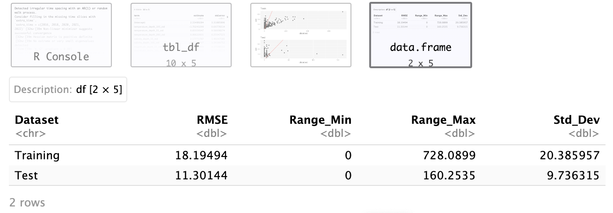
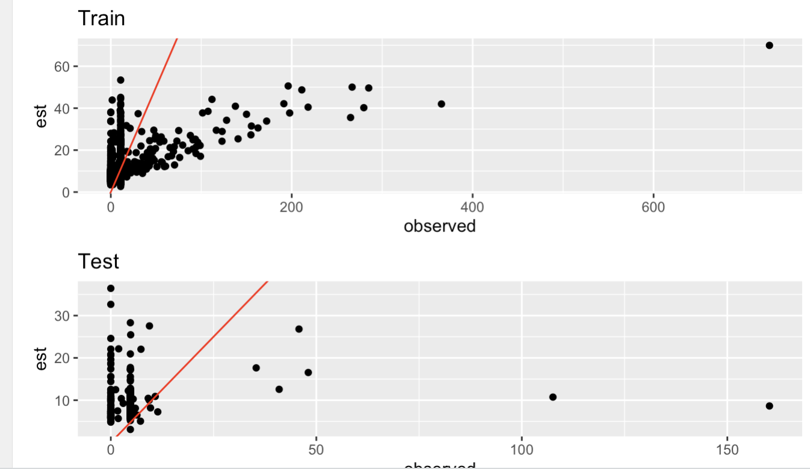
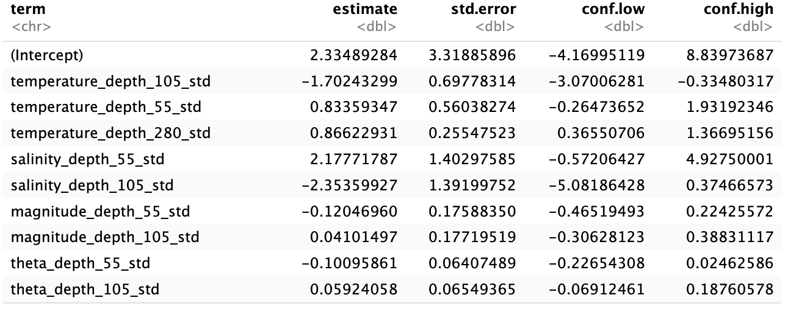

## Load Packages and Data

```{r, message = F, warning = F}
# Load in the libraries
library(tidyverse)
library(sdmTMB)
library(ggplot2)
library(janitor)
library(sp)
library(readr)
library(ggcorrplot)
library(Metrics)
library(naniar)
library(tibble)
library(rsample)
library(caret)
library(purrr)
library(tune)
library(ggExtra)

# Read in the data
cal_data <- read.csv("/Users/josh/Documents/GitHub/capstone-scripps/data/Merged_CalCOFI/STD_CalCOFI_final")
```

## Data Cleaning

```{r}
# Removing the first two columns
cal_data <- cal_data[, -c(1, 2)]

# Removing larvae and euphasia abundance
cal_data <- cal_data %>% 
  select(-euphasia_abundance, -euphasia_abundance_std, -larvae_count, -larvae_count_std, - total_abundance, -total_abundance_std)

# Changing dataset to only have present response data
cal_data <- cal_data %>% 
  filter(!is.na(x20hz_scaled))
```

## Exploratory Data Analysis


```{r, eval = FALSE}
predictors <- c(
  "lon", "lat", "date", "season", "est_depth",
  "temperature_depth_55", "temperature_depth_105", "temperature_depth_280",
  "pressure_depth_55", "pressure_depth_105", "pressure_depth_280",
  "salinity_depth_55", "salinity_depth_105", "salinity_depth_280",
  "magnitude_depth_55", "magnitude_depth_105", "magnitude_depth_280",
  "theta_depth_55", "theta_depth_105", "theta_depth_280"
)

for (var in predictors) {
  clean_data <- cal_data[!is.na(cal_data[[var]]) & !is.na(cal_data$x20hz_scaled), ]
  
  base_plot <- ggplot(clean_data, aes_string(x = var, y = "x20hz_scaled")) +
    geom_point(alpha = 0.6) +
    geom_smooth() +
    theme_classic() +
    ggtitle(paste("x20hz_scaled vs", var))
  
  print(ggMarginal(base_plot, type = "histogram"))
}

```


```{r, eval=FALSE}
predictors <- c(
  "lon", "lat", "date", "season", "est_depth",
  "temperature_depth_55", "temperature_depth_105", "temperature_depth_280",
  "pressure_depth_55", "pressure_depth_105", "pressure_depth_280",
  "salinity_depth_55", "salinity_depth_105", "salinity_depth_280",
  "magnitude_depth_55", "magnitude_depth_105", "magnitude_depth_280",
  "theta_depth_55", "theta_depth_105", "theta_depth_280"
)

for (var in predictors) {
  clean_data <- cal_data[!is.na(cal_data[[var]]) & !is.na(cal_data$x20hz_scaled), ]
  clean_data <- clean_data %>% filter(x20hz_scaled != 0)
  
  base_plot <- ggplot(clean_data, aes_string(x = var, y = "x20hz_scaled")) +
    geom_point(alpha = 0.6) +
    geom_smooth() +
    theme_classic() +
    ggtitle(paste("x20hz_scaled vs", var))
  
  print(ggMarginal(base_plot, type = "histogram"))
}

```

### Correlation Plot

```{r}
# Plotting Correlation
# Define expected columns
cols_to_use <- c("est_depth", 
                 "temperature_depth_105", "temperature_depth_280", "temperature_depth_55", 
                 "salinity_depth_105", "salinity_depth_280", "salinity_depth_55", 
                 "meridional_velocity_depth_105", "meridional_velocity_depth_280", "meridional_velocity_depth_55", 
                 "zonal_velocity_depth_105", "zonal_velocity_depth_280", "zonal_velocity_depth_55", 
                 "vertical_velocity_depth_105", "vertical_velocity_depth_280", "vertical_velocity_55", "lon", "lat", "season")

# Keep only existing columns
existing_cols <- intersect(cols_to_use, colnames(cal_data))
cor_data <- cal_data[, existing_cols, drop = FALSE]

# Compute correlation matrix (use complete.obs to skip missing data)
cor_matrix <- cor(cor_data, use = "complete.obs")

# Correlation plot
ggcorrplot(cor_matrix, 
           lab = TRUE, 
           hc.order = TRUE, 
           lab_size =2,
           tl.cex = 5,
           type = "lower", 
           title = "Correlation Plot")
```

### Missing Data

```{r}
# Count how many missing values there are
sum(is.na(cal_data))

# Visualize missing data
missing_data_plot <- naniar::vis_miss(cal_data)
print(missing_data_plot)
```

### Autocorrelation Detection

```{r}
acf(cal_data$x20hz_scaled)

pacf(cal_data$x20hz_scaled)
```

## Splitting the Data

```{r}
# Split data into training and testing sets with most recent year as our testing set
set.seed(123)
last_year <- max(cal_data$year)
train_data <- cal_data %>% filter(year != last_year)
test_data <- cal_data %>% filter(year == last_year)

#train_data <- cal_data %>% filter(!year %in% c(2022,2023))
#test_data <- cal_data %>% filter(year %in% c(2022,2023))


```

## Modeling

### Forward Stepwise Selection

```{r}
# Wait for Dr. Baracaldo
```

### Delta-Gamma Model

#### Intercept with `spatial = "on"`

```{r, eval = FALSE}
# Create mesh using training data
mesh_train <- make_mesh(train_data,
                        xy_cols = c("X", "Y"),
                        cutoff = 10)

# Fit spatiotemporal model
fit_spatiotemporal <- sdmTMB(
  x20hz_scaled ~ 1, 
  data = train_data, 
  mesh = mesh_train,
  time = "season",
  family = delta_gamma(link1 = "logit", link2 = "log"), 
  spatial = "on", 
  spatiotemporal = "iid",
  extra_time = unique(test_data$season)
)

# Extract coefficients and sanity check
# tidy(fit_spatiotemporal, conf.int = TRUE)
sanity(fit_spatiotemporal)

# Predictions on training and test data
training_pred <- predict(fit_spatiotemporal, newdata = train_data, type = "response")
training_pred$observed <- train_data$x20hz_scaled

test_pred <- predict(fit_spatiotemporal, newdata = test_data, type = "response")
test_pred$observed <- test_data$x20hz_scaled

# Plotting the predictions
p0 <- ggplot(training_pred, aes(x = observed, y = est)) + 
  geom_point() + 
  ggtitle("Train") + 
  geom_abline(intercept = 0, slope = 1, col = "red")

p1 <- ggplot(test_pred, aes(x = observed, y = est)) + 
  geom_point() + 
  ggtitle("Test") + 
  geom_abline(intercept = 0, slope = 1, col = "red")

gridExtra::grid.arrange(p0, p1)

# Compute RMSE
rmse_train <- rmse(training_pred$observed, training_pred$est)
rmse_test <- rmse(test_pred$observed, test_pred$est)

# Compute Range
range_train <- range(train_data$x20hz_scaled)
range_test <- range(test_data$x20hz_scaled)

# Compute Standard Deviation
sd_train <- sd(train_data$x20hz_scaled, na.rm = TRUE)
sd_test <- sd(test_data$x20hz_scaled, na.rm = TRUE)

# Assemble the table
summary_table <- data.frame(
  Dataset = c("Training", "Test"),
  RMSE = c(rmse_train, rmse_test),
  Range_Min = c(range_train[1], range_test[1]),
  Range_Max = c(range_train[2], range_test[2]),
  Std_Dev = c(sd_train, sd_test)
)

# Print the summary table
print(summary_table)
```

#### Intercept with `spatial = "off"`
```{r, eval = FALSE}
# Create mesh using training data
mesh_train <- make_mesh(train_data,
                        xy_cols = c("X", "Y"),
                        cutoff = 10)

# Fit spatiotemporal model
fit_spatiotemporal <- sdmTMB(
  x20hz_scaled ~ 1, 
  data = train_data, 
  mesh = mesh_train,
  time = "season",
  family = delta_gamma(link1 = "logit", link2 = "log"), 
  spatial = "off", 
  spatiotemporal = "iid",
  extra_time = unique(test_data$season)
)

# Extract coefficients and sanity check
# tidy(fit_spatiotemporal, conf.int = TRUE)
sanity(fit_spatiotemporal)

# Predictions on training and test data
training_pred <- predict(fit_spatiotemporal, newdata = train_data, type = "response")
training_pred$observed <- train_data$x20hz_scaled

test_pred <- predict(fit_spatiotemporal, newdata = test_data, type = "response")
test_pred$observed <- test_data$x20hz_scaled

# Plotting the predictions
p0 <- ggplot(training_pred, aes(x = observed, y = est)) + 
  geom_point() + 
  ggtitle("Train") + 
  geom_abline(intercept = 0, slope = 1, col = "red")

p1 <- ggplot(test_pred, aes(x = observed, y = est)) + 
  geom_point() + 
  ggtitle("Test") + 
  geom_abline(intercept = 0, slope = 1, col = "red")

gridExtra::grid.arrange(p0, p1)

# Compute RMSE
rmse_train <- rmse(training_pred$observed, training_pred$est)
rmse_test <- rmse(test_pred$observed, test_pred$est)

# Compute Range
range_train <- range(train_data$x20hz_scaled)
range_test <- range(test_data$x20hz_scaled)

# Compute Standard Deviation
sd_train <- sd(train_data$x20hz_scaled, na.rm = TRUE)
sd_test <- sd(test_data$x20hz_scaled, na.rm = TRUE)

# Assemble the table
summary_table <- data.frame(
  Dataset = c("Training", "Test"),
  RMSE = c(rmse_train, rmse_test),
  Range_Min = c(range_train[1], range_test[1]),
  Range_Max = c(range_train[2], range_test[2]),
  Std_Dev = c(sd_train, sd_test)
)

# Print the summary table
print(summary_table)
```
Intercepts with spatial on vs. spatial off produce the same results.


```{r, eval = FALSE}
# Create mesh using training data
mesh_train <- make_mesh(train_data,
                        xy_cols = c("X", "Y"),
                        cutoff = 5)

# Fit spatiotemporal model
fit_spatiotemporal <- sdmTMB(
  x20hz_scaled ~ temperature_depth_105_std + temperature_depth_55_std + temperature_depth_280_std + salinity_depth_55_std + salinity_depth_105_std + magnitude_depth_55_std + magnitude_depth_105_std + theta_depth_55_std + theta_depth_105_std,  
  data = train_data, 
  mesh = mesh_train,
  time = "season",
  family = delta_gamma(link1 = "logit", link2 = "log"),
  spatial = "off", 
  spatiotemporal = "rw",
  extra_time = unique(test_data$season)
)

# Extract coefficients and sanity check
tidy(fit_spatiotemporal, conf.int = TRUE)
sanity(fit_spatiotemporal)

# Predictions on training and test data
training_pred <- predict(fit_spatiotemporal, newdata = train_data, type = "response")
training_pred$observed <- train_data$x20hz_scaled

test_pred <- predict(fit_spatiotemporal, newdata = test_data, type = "response")
test_pred$observed <- test_data$x20hz_scaled

# Plotting the predictions
p0 <- ggplot(training_pred, aes(x = observed, y = est)) + 
  geom_point() + 
  ggtitle("Train") + 
  geom_abline(intercept = 0, slope = 1, col = "red")

p1 <- ggplot(test_pred, aes(x = observed, y = est)) + 
  geom_point() + 
  ggtitle("Test") + 
  geom_abline(intercept = 0, slope = 1, col = "red")

gridExtra::grid.arrange(p0, p1)

# Compute RMSE
rmse_train <- rmse(training_pred$observed, training_pred$est)
rmse_test <- rmse(test_pred$observed, test_pred$est)

# Compute Range
range_train <- range(train_data$x20hz_scaled, na.rm = TRUE)
range_test <- range(test_data$x20hz_scaled, na.rm = TRUE)

# Compute Standard Deviation
sd_train <- sd(train_data$x20hz_scaled, na.rm = TRUE)
sd_test <- sd(test_data$x20hz_scaled, na.rm = TRUE)

# Assemble the table
summary_table <- data.frame(
  Dataset = c("Training", "Test"),
  RMSE = c(rmse_train, rmse_test),
  Range_Min = c(range_train[1], range_test[1]),
  Range_Max = c(range_train[2], range_test[2]),
  Std_Dev = c(sd_train, sd_test)
)

# Print the summary table
print(summary_table)

```
#### Predictors with `spatial = on`


```{r, eval = FALSE}
# Create mesh using training data
mesh_train <- make_mesh(train_data,
                        xy_cols = c("X", "Y"),
                        cutoff = 5)

# Fit spatiotemporal model
fit_spatiotemporal <- sdmTMB(
  x20hz_scaled ~ temperature_depth_55_std + temperature_depth_105_std + temperature_depth_280_std + salinity_depth_55_std + salinity_depth_105_std + magnitude_depth_55_std + magnitude_depth_105_std + theta_depth_105_std + theta_depth_55_std,  
  data = train_data, 
  mesh = mesh_train,
  time = "season",
  family = delta_gamma(link1 = "logit", link2 = "log"),
  spatial = "on", 
  spatiotemporal = "rw",
  extra_time = unique(test_data$season)
)

# Extract coefficients and sanity check
tidy(fit_spatiotemporal, conf.int = TRUE)
sanity(fit_spatiotemporal)

# Predictions on training and test data
training_pred <- predict(fit_spatiotemporal, newdata = train_data, type = "response")
training_pred$observed <- train_data$x20hz_scaled

test_pred <- predict(fit_spatiotemporal, newdata = test_data, type = "response")
test_pred$observed <- test_data$x20hz_scaled

# Plotting the predictions
p0 <- ggplot(training_pred, aes(x = observed, y = est)) + 
  geom_point() + 
  ggtitle("Train") + 
  geom_abline(intercept = 0, slope = 1, col = "red")

p1 <- ggplot(test_pred, aes(x = observed, y = est)) + 
  geom_point() + 
  ggtitle("Test") + 
  geom_abline(intercept = 0, slope = 1, col = "red")

gridExtra::grid.arrange(p0, p1)

# Compute RMSE
rmse_train <- rmse(training_pred$observed, training_pred$est)
rmse_test <- rmse(test_pred$observed, test_pred$est)

# Compute Range
range_train <- range(train_data$x20hz_scaled, na.rm = TRUE)
range_test <- range(test_data$x20hz_scaled, na.rm = TRUE)

# Compute Standard Deviation
sd_train <- sd(train_data$x20hz_scaled, na.rm = TRUE)
sd_test <- sd(test_data$x20hz_scaled, na.rm = TRUE)

# Assemble the table
summary_table <- data.frame(
  Dataset = c("Training", "Test"),
  RMSE = c(rmse_train, rmse_test),
  Range_Min = c(range_train[1], range_test[1]),
  Range_Max = c(range_train[2], range_test[2]),
  Std_Dev = c(sd_train, sd_test)
)

# Print the summary table
print(summary_table)
```


# the 20 HZ

these are with RW




make a classification model to predict is there a call?

eliminate 0's then make a model that only predicts existing calls

tmux to keep things running with computer closed

```{r}
clean_data <- cal_data %>% filter(x20hz_scaled != 0)

last_year2 <- max(clean_data$year)
train_data2 <- clean_data %>% filter(year != last_year2)
test_data2 <- clean_data %>% filter(year == last_year2)

mesh_train2 <- make_mesh(train_data2,
                        xy_cols = c("X", "Y"),
                        cutoff = 5)

# Fit spatiotemporal model
fit_spatiotemporal <- sdmTMB(
  x20hz_scaled ~ temperature_depth_55_std + theta_depth_55_std ,  
  data = train_data2, 
  mesh = mesh_train2,
  time = "season",
  family = delta_gamma(link1 = "logit", link2 = "log"),
  spatial = "on", 
  spatiotemporal = "rw",
  extra_time = unique(test_data2$season)
)

# Extract coefficients and sanity check
tidy(fit_spatiotemporal, conf.int = TRUE)
sanity(fit_spatiotemporal)

# Predictions on training and test data
training_pred <- predict(fit_spatiotemporal, newdata = train_data2, type = "response")
training_pred$observed <- train_data2$x20hz_scaled

test_pred <- predict(fit_spatiotemporal, newdata = test_data2, type = "response")
test_pred$observed <- test_data2$x20hz_scaled

# Plotting the predictions
p0 <- ggplot(training_pred, aes(x = observed, y = est)) + 
  geom_point() + 
  ggtitle("Train") + 
  geom_abline(intercept = 0, slope = 1, col = "red")

p1 <- ggplot(test_pred, aes(x = observed, y = est)) + 
  geom_point() + 
  ggtitle("Test") + 
  geom_abline(intercept = 0, slope = 1, col = "red")

gridExtra::grid.arrange(p0, p1)

# Compute RMSE
rmse_train <- rmse(training_pred$observed, training_pred$est)
rmse_test <- rmse(test_pred$observed, test_pred$est)

# Compute Range
range_train <- range(train_data2$x20hz_scaled, na.rm = TRUE)
range_test <- range(test_data2$x20hz_scaled, na.rm = TRUE)

# Compute Standard Deviation
sd_train <- sd(train_data2$x20hz_scaled, na.rm = TRUE)
sd_test <- sd(test_data2$x20hz_scaled, na.rm = TRUE)

# Assemble the table
summary_table <- data.frame(
  Dataset = c("Training", "Test"),
  RMSE = c(rmse_train, rmse_test),
  Range_Min = c(range_train[1], range_test[1]),
  Range_Max = c(range_train[2], range_test[2]),
  Std_Dev = c(sd_train, sd_test)
)

# Print the summary table
print(summary_table)

```
```{r}
AIC(fit_spatiotemporal)
```
