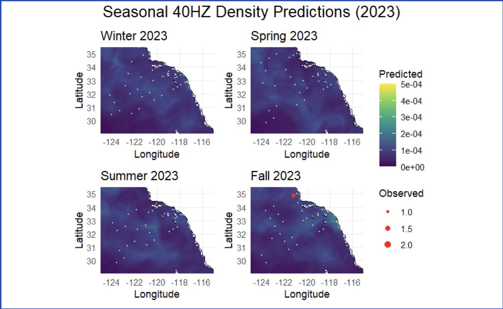

```{r setup, include = FALSE}

knitr::opts_chunk$set(echo = F,
                      results = 'markup',
                      fig.pos = "H",
                      fig.width = 6,
                      fig.height = 6,
                      fig.align = 'center',
                      message = F,
                      warning = F)

# Load in the libraries
library(tidyverse)
library(sdmTMB)
library(ggplot2)
library(janitor)
library(sp)
library(readr)
library(ggcorrplot)
library(Metrics)
library(naniar)
library(tibble)
library(rsample)
library(caret)
library(purrr)
library(tune)
library(ggExtra)
library(ggOceanMaps)
library(dplyr)

```

# Introduction 

Researching the presence of blue and fin whales and their reliance on distinct call types for behaviors (such as foraging and reproduction) is important for monitoring ecosystem health and guiding conservation efforts in the California Current System. By analyzing their calls in relation with environmental data, we can gain insight into their behavioral patterns and habitat use across time.

Several foundational studies guided our research by providing us a solid background understanding on our topic. For example, Becker et al. (2022) studied how different whale species use habitat across the California Current and showed that it's important to use flexible models that can account for changes in space and time. Campbell et al. (2015) showed that there were long-term trends in whale sightings using CalCOFI visual survey data, while Oleson et al. (2007) and Širović et al. (2013) demonstrated that specific whale call types correlate with behavioral states, supporting our decision to model each call type separately.

Therefore, the goal of this project is to develop species distribution models for blue and fin whale acoustic presence using environmental drivers, and to visualize their occurrence across time. We also aim to interpret call-type-specific patterns to better understand behavioral ecology. Specifically, my job is to investigate the abundance distribution of 40hz call fin whale particularly. 

# Dataset 

We work with a combined data set contain information of whale calls from CalCOFI and ocean conditions (environmental variables) from CASE-STSE.

### CASE-STSE

The CASE-STSE dataset collects oceanographic data over one- to three-month periods to generate detailed analyses and 30-day forecasts of ocean conditions. It includes observations from various sources, including underwater gliders, temperature probes, floating sensors, and satellites. The dataset includes three-dimensional fields of temperature, salinity, pressure, and velocity, making it a valuable resource for understanding dynamic ocean processes. More information and data products can be accessed at <https://ecco.ucsd.edu/case_stse_results1.html>.

### CalCoFI

The CalCoFI dataset contains data on whale detection across survey stations, comprising of visual surveys, acoustic recordings, and environmental DNA detections. The resulting data includes the number of individual calls and their types (or response variables), such as A, B, and D calls for blue whales, and A, B, D, 20 Hz and 40 Hz calls for fin whales. These response variables will tell us how environmental variables affects different whales/each individual call. Prior to conducting our project, we conducted exploratory data analysis to better understand this dataset.

```{r}
# Read in the data
cal_data <- read.csv("~/Desktop/2025 Winter/PSTAT 197B/capstone-scripps/data/Merged_CalCOFI/merged_std_data_05_13_25.csv")

```

# Methodology 

**Preprocessing**
Using an adapted MATLAB script, we extracted relevant CASE-STSE variables and computed monthly cruise averages aligned with acoustic observations. The resulting dataset was indexed by year and month. Furthermore, we scaled all whale call types from CalCOFI by duration of sonobuoy deployment and projected latitude and longitude in kilometers.

We then integrated whale acoustic data with environmental variables to examine how environmental conditions influence whale acoustic presence across space and time in the Southern California Bight.

- Temporal Matching: Records from CalCOFI and CASE-STSE were joined by matching the common year-month field.

- Spatial Matching: For each CalCOFI observation, the nearest CASE-STSE grid cell with non NA value was identified using k-nearest neighbors on latitude and longitude coordinates.

**Feature Engineering**
We initially explored the relationships between whale call types and environmental predictors using `ggplot2`.

**Model Development**
We developed a spatiotemporal model using the `sdmTMB` package, which enables spatially explicit modeling with generalized linear mixed-effects frameworks. We selected a delta-gamma distribution to handle zero-inflated acoustic presence data and varied combinations of predictors, spatial mesh sizes, and parameters to optimize model performance.

**Evaluation**
Model performance was assessed using Root Mean Square Error (RMSE) and standard deviation of observed values to evaluate both accuracy and variability.

## Data Cleaning

We excluded redundant columns and filtered out `NA` values for response -- 40 Hz call in my case.

```{r}
# Removing the first two columns
cal_data <- cal_data[, -c(1, 2)]

# Changing dataset to only have present response data
cal_data <- cal_data %>% 
  filter(!is.na(x40hz_scaled))

# Season Splitting 
cal_data$season_frac <- cal_data$season %% 1
```

# Exploratory Data Analysis(EDA)

We conducted exploratory data analysis to investigate the relationship between the predictors `environmental variables` and response variable `x40hz_scaled` in our spatiotemporal model. This process visualized spatial and temporal trend and generated scaterplots and correlation matrices to access linear and non-linear associations 

## Relationship Between Response and Predictors

We observed that the response variable is highly zero-inflated, which may be attributed to several factors: (1) the absence of whales in the area, (2) the presence of whales that did not produce detectable sounds, or (3) the presence of loud background noise that masked the whale vocalizations. In order to explore the association between environmental variables and whale calls, we filtered zero value for visualizations.

```{r}
x40hz_scaled_filtered<-cal_data %>% filter(x40hz_scaled!= 0)
x40hz_scaled_filtered$season_frac <- x40hz_scaled_filtered$season %% 1
```


```{r, message = FALSE, fig.width = 4, fig.height = 3, fig.cap="40Hz Calls vs. Longitude"}
# Scatterplot with line of fit
p1<-ggplot(x40hz_scaled_filtered, aes(x = lon, y = x40hz_scaled)) +
  geom_point() +                 # Scatter points
  theme_classic()

ggMarginal(p1, type = "histogram")
```

```{r, message = FALSE,fig.width = 4, fig.height = 3, fig.cap="40Hz Calls vs. Latitude"}
# Scatterplot with line of fit
p2<-ggplot(x40hz_scaled_filtered, aes(x = lat, y = x40hz_scaled)) +
  geom_point() +                 # Scatter points
  theme_classic()
ggMarginal(p2, type = "histogram")
```
We observe several density peaks at longitudes around −121, −119, and −118, and at latitudes near 32 and 34. Notably, most recorded observations are close to zero, indicating the sparsity of this fin whale call type, which can affect model performance.

```{r, message = FALSE, fig.width = 4, fig.height = 3, fig.cap="40Hz Calls vs. Season"}
# Scatterplot with line of fit
p4<-ggplot(x40hz_scaled_filtered, aes(x = season_frac, y = x40hz_scaled)) +
  geom_point() +                 # Scatter points
  theme_classic()
ggMarginal(p4, type = "histogram")
```
40hz fin whales present the most in winter (`season = 0.00`) and fall (`season = 0.75`), and the least in summer (`season = 0.5`).

```{r,r, message = FALSE, fig.width = 6, fig.height = 8, fig.cap="Seasonal 40 Hz Fin Whale Distribution"}
basemap(data = x40hz_scaled_filtered, bathymetry = T) + 
  # Plot whale data points
  geom_point(data = x40hz_scaled_filtered, aes(x = lon, y = lat, color = x40hz_scaled), size = 1)+
  # Add color gradient and adjust point size
  scale_color_gradient(low = "yellow", high = "red",limits = c(0, 23)) +
  labs(title = "40 hz call distribution", 
       x = "Longitude", y = "Latitude", 
       color = "Observed Whale Number") +
  theme_minimal()+
  theme(axis.text.x = element_text(size = 3))+
  facet_grid(rows = vars(year), cols = vars(season_frac))
```

Here is an ocean map to visualize all information discussed above. Across multiple years (e.g., `2012–2015`, `2022–2023`), there are repeated observations of higher call counts (yellow to red dots) near longitude `121°W` to `119°W`, latitude `32°N` to `34°N`. Calls often cluster in deeper waters, away from the immediate coast — consistent with bathymetric contours in the 1000–4000 m range. However, most plots have few (near zero) detections, indicating that the 40 Hz call events are rare.


```{r, message = FALSE,fig.width = 4, fig.height = 3, fig.cap = "40Hz Calls vs. Estimated Depth by season"}
# Scatterplot with line of fit
p5<-ggplot(x40hz_scaled_filtered, aes(x = est_depth, y = x40hz_scaled, color = as.factor(season_frac))) +
  geom_point() +    
  theme_classic() +
  labs(color = "Season")

ggMarginal(p5, type = "histogram")

# est_fit_1 <- lm(x40hz_scaled ~ poly(est_depth, 1, raw = TRUE), data = x40hz_scaled_filtered)
est_fit_2 <- lm(x40hz_scaled ~ poly(est_depth, 2, raw = TRUE), data = x40hz_scaled_filtered)
# est_fit_3 <-lm(x40hz_scaled ~ poly(est_depth, 3, raw = TRUE), data = x40hz_scaled_filtered)

# AIC(est_fit_1,est_fit_2,est_fit_3)
```

### 40Hz vs. Temperature

```{r, message = FALSE, fig.cap= "40Hz vs. Temperature"}
# Scatterplot with line of fit
tp1<-ggplot(x40hz_scaled_filtered, aes(x = temperature_depth_55, y = x40hz_scaled)) +
  geom_point() +                 # Scatter points
  geom_smooth(method = "loess") +
  labs(title = "40Hz vs. Temperature at Depth 55m")+
  theme_classic() 

tp2<-ggplot(x40hz_scaled_filtered, aes(x = temperature_depth_105, y = x40hz_scaled)) +
  geom_point() +                 # Scatter points
  geom_smooth(method = "loess") + # Linear model fit line
  labs(title = "40Hz vs. Temperature at Depth 105m")+
  theme_classic()

tp3<-ggplot(x40hz_scaled_filtered, aes(x = temperature_depth_280, y = x40hz_scaled)) +
  geom_point() +                 # Scatter points
   geom_smooth(method = "loess") +
  labs(title = "40Hz vs. Temperature at Depth 280m")+
  theme_classic()
gridExtra::grid.arrange(tp1, tp2, tp3)
```


```{r, message = FALSE}
p6_1<-ggplot(x40hz_scaled_filtered, aes(x = temperature_depth_55, y = x40hz_scaled,color = as.factor(season_frac))) +
  geom_point() +
  geom_smooth(method = "loess", se=F)+
  theme_classic()+
  labs(color = "Season")

temp_55<-ggMarginal(p6_1, type = "histogram")

p7<-ggplot(x40hz_scaled_filtered, aes(x = temperature_depth_105, y = x40hz_scaled,color = as.factor(season_frac))) +
  geom_point() +
  geom_smooth(method = "loess", se=F)+
  theme_classic()+
  labs(color = "Season")
temp_105<-ggMarginal(p7, type = "histogram")

p8<-ggplot(x40hz_scaled_filtered, aes(x = temperature_depth_280, y = x40hz_scaled, color = as.factor(season_frac))) +
  geom_point() +
  geom_smooth(method = "loess", se=F)+
  theme_classic()+
  labs(color = "Season")

temp_208<-ggMarginal(p8, type = "histogram")
```


```{r, message = FALSE, fig.width = 6, fig.height = 6, fig.cap="40Hz call VS. temperature at different depth by season"}
gridExtra::grid.arrange(temp_55, temp_105, temp_208)
```

At **depth 55m**, whale call abundance shows a seasonal peak around 14-15 degree Celsius especially for `season = 0.25`. 

At **depth 105m** Similar pattern shows where it is more clear that the abundance declined after 17.5-18 degree Celsius. 

At **depth 280m**, the histogram further confirmed that higher call activity occurs around 15 degree Celsius. However, abnormal pattern detected for `season = 0.5`, where the fitted line suggested negative number around 14.5 degree Celsius which is inconsistent with the previous findings and thus suggests less influence to fin whale distribution.

Additionally, when examining the association between temperature and whale call occurrence across all seasons, only the temperature at a depth of 55m shows a clear non-linear relationship. In contrast, fitted lines for other depths appear mostly linear, suggesting they contribute less to explaining the response.


### 40Hz vs. Pressure

```{r, message = FALSE, fig.cap="40Hz vs. Pressure"}
# Scatterplot with line of fit

ps1<-ggplot(x40hz_scaled_filtered, aes(x = pressure_depth_55, y = x40hz_scaled)) +
  geom_point() +                 # Scatter points
  geom_smooth(method = "loess") + # Linear model fit line
  labs(title = "40Hz vs. Pressure at Depth 55m")+
  theme_classic()
ps2<-ggplot(x40hz_scaled_filtered, aes(x = pressure_depth_105, y = x40hz_scaled)) +
  geom_point() +                 # Scatter points
  geom_smooth(method = "loess") + # Linear model fit line
  labs(title = "40Hz Calls vs. Pressure at Depth 105m")+
  theme_classic()
ps3<-ggplot(x40hz_scaled_filtered, aes(x = pressure_depth_280, y = x40hz_scaled)) +
  geom_point() +                 # Scatter points
  geom_smooth(method = "loess") + # Linear model fit line
  labs(title = "40Hz Calls vs. Pressure at Depth 280m")+
  theme_classic()

gridExtra::grid.arrange(ps1, ps2, ps3)
```


```{r, message = FALSE}
p9<-ggplot(x40hz_scaled_filtered, aes(x = pressure_depth_55, y = x40hz_scaled, color = as.factor(season_frac))) +
  geom_point() +                 # Scatter points
  geom_smooth(method = "loess",se = FALSE) + # Linear model fit line
  theme_classic() + 
  labs(color = "season")
press_55<-ggMarginal(p9, type = "histogram")

p10<-ggplot(x40hz_scaled_filtered, aes(x = pressure_depth_105, y = x40hz_scaled, color = as.factor(season_frac))) +
  geom_point() +                 # Scatter points
  geom_smooth(method = "loess",se = FALSE) + # Linear model fit line
  theme_classic() + 
  labs(color = "season")

press_105<-ggMarginal(p10, type = "histogram")

p11<-ggplot(x40hz_scaled_filtered, aes(x = pressure_depth_280, y = x40hz_scaled, color = as.factor(season_frac))) +
  geom_point() +                 # Scatter points
  geom_smooth(method = "loess",se = FALSE) + # Linear model fit line
  theme_classic() + 
  labs(color = "season") 
press_280<-ggMarginal(p11, type = "histogram")

```

```{r, message = FALSE, fig.width = 6, fig.height = 6,fig.cap = "40Hz Calls vs. Pressure at Different Depth by Season"}
gridExtra::grid.arrange(press_55, press_105, press_280)
```

At **depth 55m**, whale call abundance shows a seasonal peak around **-1.5Pa** especially for spring (`season = 0.25`) and summer (`season = 0.5`). 

At **depth 105m**, the peak shifts to **−2.5 Pa**, with notable overlap between spring and summer.

At **depth 280m**, the histogram further confirmed that higher call activity occurs around **-2.5Pa**. However, a different pattern detected for spring (`season = 0.25`), where the fitted line flattens before **−3 Pa**, unlike shallower depths.

While pressure at all depths exhibits a non-linear relationship with whale call occurrence, it is strongly correlated with depth. Therefore, we excluded pressure as a predictor in the model.

### 40Hz vs. Salinity 

```{r, message = FALSE, fig.cap="40Hz Calls vs. Salinity"}

ss1<-ggplot(x40hz_scaled_filtered, aes(x = salinity_depth_55, y = x40hz_scaled)) +
  geom_point() +                 # Scatter points
  geom_smooth(method = "loess", se = T) + # Linear model fit line
  labs(title = "40Hz Calls vs. Salinity at Depth 55m")+
  theme_classic()
ss2<-ggplot(x40hz_scaled_filtered, aes(x = salinity_depth_105, y = x40hz_scaled)) +
  geom_point() +                 # Scatter points
  geom_smooth(method = "loess") + # Linear model fit line
  labs(title = "40Hz Calls vs. Salinity at Depth 105m")+
  theme_classic()
ss3<-ggplot(x40hz_scaled_filtered, aes(x = salinity_depth_280, y = x40hz_scaled)) +
  geom_point() +                 # Scatter points
  geom_smooth(method = "loess") + # Linear model fit line
  labs(title = "40Hz Calls vs. Salinity at Depth 280m")+
  theme_classic()
gridExtra::grid.arrange(ss1, ss2, ss3)
```


```{r, message = FALSE}
p12<-ggplot(x40hz_scaled_filtered, aes(x = salinity_depth_55, y = x40hz_scaled, color = as.factor(season_frac))) +
  geom_point() +                 # Scatter points
  geom_smooth(method = "loess", se = F) + # Linear model fit line
  theme_classic() +
  labs(color = "Season")

sal_55<-ggMarginal(p12, type = "histogram")

p13<-ggplot(x40hz_scaled_filtered, aes(x = salinity_depth_105, y = x40hz_scaled, color = as.factor(season_frac))) +
  geom_point() +                 # Scatter points
  geom_smooth(method = "loess", se = F) + # Linear model fit line
  theme_classic() +
  labs(color = "Season")
sal_105<-ggMarginal(p13, type = "histogram")

p14<-ggplot(x40hz_scaled_filtered, aes(x = salinity_depth_55, y = x40hz_scaled, color = as.factor(season_frac))) +
  geom_point() +                 # Scatter points
  geom_smooth(method = "loess", se = F) + # Linear model fit line
  theme_classic() +
  labs(color = "Season")
sal_280<-ggMarginal(p14, type = "histogram")
```

```{r, message = FALSE,fig.width = 6, fig.height = 6,fig.cap="40Hz Calls vs. Salinity at Different Depth by Season"}
gridExtra::grid.arrange(sal_55, sal_105, sal_280)
```

At **depth 55m**, the histogram shows a general peak in whale call abundance around **33.5 PSU**. Seasonally, the fitted lines indicate a peak at **33.6 PSU** during summer (`season = 0.5`) and **33.5 PSU** in spring (`season = 0.25`), with no clear pattern in winter or fall.

At **depth 105m**, a sharper seasonal peaks shows at **33.6PSU** for summer (`season = 0.5`) comparing to shallower depth. The remaining seasons follow a pattern similar to that at 55m.

At **depth 280m**, similar pattern detected with depth at 55m where whale call abundance shows peak at **33.6 PSU** for summer and **33.5 PSU** for summer.

Across all graphs, including the ones without specifying seasons, all show a non-linear relationship after **salinity = 33.3PSU**, indicating salinity as a potential threshold influencing whale presence.


### 40Hz vs. Current Magnitude 

```{r, message = FALSE, warning = FALSE, fig.cap= "40Hz Calls vs. Current Velocity Magnitude"}
# Scatterplot with line of fit

ms1<-ggplot(x40hz_scaled_filtered, aes(x = magnitude_depth_55, y = x40hz_scaled)) +
  geom_point() +                 # Scatter points
  geom_smooth(method = "loess") + # Linear model fit line
  labs(title = "40Hz Calls vs. Magnitude at Depth 55m")+
  theme_classic()
ms2<-ggplot(x40hz_scaled_filtered, aes(x = magnitude_depth_105, y = x40hz_scaled)) +
  geom_point() +                 # Scatter points
  geom_smooth(method = "loess") + # Linear model fit line
  labs(title = "40Hz Calls vs. Magnitude at Depth 105m")+
  theme_classic()
ms3<-ggplot(x40hz_scaled_filtered, aes(x = magnitude_depth_280, y = x40hz_scaled)) +
  geom_point() +                 # Scatter points
  geom_smooth(method = "loess") + # Linear model fit line
  labs(title = "40Hz Calls vs. Magnitude at Depth 280m")+
  theme_classic()

gridExtra::grid.arrange(ms1, ms2, ms3)

```


```{r, message = FALSE, warning = FALSE}
p15<- ggplot(x40hz_scaled_filtered, aes(x = magnitude_depth_55, y = x40hz_scaled, color = as.factor(season_decimal))) +
  geom_point() +                 # Scatter points
  geom_smooth(method = "loess", se=F) + # Linear model fit line
  labs(color = "season") +
  theme_classic()


mag_55<-ggMarginal(p15, type = "histogram")

p16<-ggplot(x40hz_scaled_filtered, aes(x = magnitude_depth_105, y = x40hz_scaled,color = as.factor(season_decimal))) +
  geom_point() +                 # Scatter points
  geom_smooth(method = "loess",se =F) + # Linear model fit line
  labs(color = "season") +
  theme_classic()
mag_105<-ggMarginal(p16, type = "histogram")

p17<-ggplot(x40hz_scaled_filtered, aes(x = magnitude_depth_280, y = x40hz_scaled, color = as.factor(season_frac))) +
  geom_point() +                 # Scatter points
  geom_smooth(method = "loess",se = F) + # Linear model fit line
  labs(color = "season") +
  theme_classic()
mag_280<-ggMarginal(p17, type = "histogram")

```

```{r, message = FALSE,fig.width = 6, fig.height = 6,fig.cap="40Hz Calls vs. Magnitude at Different Depth by Season"}
gridExtra::grid.arrange(mag_55, mag_105, mag_280)
```

At **depth 55m**, the whale call abundance shows a seasonal peak around **magnitude = 0.1m/s** especially for summer (`season = 0.5`) and spring (`season = 0.25`). 

At **depth 105m**, abnormal pattern detected for summer (`season = 0.5`), where the fitted line shows a seasonal peak at **magnitude = 0.2m/s**, which contradicts with the histogram. .

At **depth 280m**, similar pattern detected with depth at 105m where abnormal pattern detected in summer and no obvious pattern for the remaining seasons. 

Across all depths and seasons, a general pattern emerges: whale call occurrence decreases between **0 and 0.05 m/s**, increases from **0.05 to 0.1 m/s**, and then gradually declines beyond that. This trend is most evident at 55m in spring and summer. Fall and winter display a more gradual decline beginning after **0.2m/s**.


### 40Hz vs. Current Angle (Theta)

```{r, message = FALSE, warning = FALSE, fig.cap = "40Hz Calls vs. Theta"}
# Scatterplot with line of fit

ths1<-ggplot(x40hz_scaled_filtered, aes(x = theta_depth_55, y = x40hz_scaled)) +
  geom_point() +                 # Scatter points
  geom_smooth(method = "loess") + # Linear model fit line
  labs(title = "40Hz Calls vs. Theta at Depth 55m")+
  theme_classic()
ths2<-ggplot(x40hz_scaled_filtered, aes(x = theta_depth_105, y = x40hz_scaled)) +
  geom_point() +                 # Scatter points
  geom_smooth(method = "loess") + # Linear model fit line
  labs(title = "40Hz Calls vs. Theta at Depth 105m")+
  theme_classic()
ths3<-ggplot(x40hz_scaled_filtered, aes(x = theta_depth_280, y = x40hz_scaled)) + 
  geom_point() +                 # Scatter points
  geom_smooth(method = "loess") + # Linear model fit line
  labs(title = "40Hz Calls vs. Theta at Depth 280m")+
  theme_classic()
gridExtra::grid.arrange(ths1, ths2, ths3)
```


```{r, message = FALSE, warning = FALSE}
p18<-ggplot(x40hz_scaled_filtered, aes(x = theta_depth_55, y = x40hz_scaled, color = as.factor(season_frac))) +
  geom_point() +                 # Scatter points
  geom_smooth(method = "loess", se=F) + # Linear model fit line
  theme_classic()+
  labs(color = "Season")

theta_55<-ggMarginal(p18, type = "histogram")

p19<-ggplot(x40hz_scaled_filtered, aes(x = theta_depth_105, y = x40hz_scaled, color = as.factor(season_frac))) +
  geom_point() +                 # Scatter points
  geom_smooth(method = "loess",se=F) + # Linear model fit line
  labs(color = "Season")+
  theme_classic()

theta_105<-ggMarginal(p19, type = "histogram")

p20<-ggplot(x40hz_scaled_filtered, aes(x = theta_depth_280, y = x40hz_scaled,color = as.factor(season_frac)))+ 
  geom_point() +                 # Scatter points
  geom_smooth(method = "loess",se=F) + # Linear model fit line
  labs(color = "Season") + 
  theme_classic()
theta_280<-ggMarginal(p20, type = "histogram")
```

```{r, message = FALSE,fig.width = 6, fig.height = 6,fig.cap="40Hz Calls vs. Theta at Different Depth by Season"}
gridExtra::grid.arrange(theta_55, theta_105, theta_280)
```

At **depth 55m**, an abnormal pattern detected for summer (`season = 0.5`), where the fitted line shows a seasonal peak at \textbf{$\theta = 0.5^\circ$}, which contradicts with the histogram.

At **depth 105m**, seasonal peaks occur around $\theta = -1^\circ$ to $0^\circ$ , with spring peaking near $-1^\circ$ and summer near $0^\circ$. These trends align well with the histogram.

At **depth 280m**, similar pattern detected with depth at 105m where distinct peaks in summer and spring, and no obvious pattern for the remaining seasons. 

Across all depths and seasons, the fitted line at 55m remains relatively flat, suggesting limited influence of this variable on whale call occurrence. In contrast, deeper layers show subtle non-linear relationships, indicating a potentially stronger association.


### Correlation Plot

```{r}
# Plotting Correlation
# Define expected columns
cols_to_use <- c("est_depth", 
                 "temperature_depth_105", "temperature_depth_280", "temperature_depth_55", 
                 "salinity_depth_105", "salinity_depth_280", "salinity_depth_55", 
                 "meridional_velocity_depth_105", "meridional_velocity_depth_280", "meridional_velocity_depth_55", 
                 "zonal_velocity_depth_105", "zonal_velocity_depth_280", "zonal_velocity_depth_55", 
                 "vertical_velocity_depth_105", "vertical_velocity_depth_280", "vertical_velocity_55", "larvae_count", "lon", "lat", "season")

# Keep only existing columns
existing_cols <- intersect(cols_to_use, colnames(cal_data))
cor_data <- cal_data[, existing_cols, drop = FALSE]

# Compute correlation matrix (use complete.obs to skip missing data)
cor_matrix <- cor(cor_data, use = "complete.obs")
```


```{r, fig.width = 6, fig.height = 6,fig.cap="Correlation Matrix Between Numeric Variables"}
# Correlation plot
ggcorrplot(cor_matrix, 
           lab = TRUE, 
           hc.order = TRUE, 
           lab_size =1.5,
           tl.cex = 5,
           type = "lower", 
           title = "Correlation Plot")
```
The correlation matrix shows that environmental variables are highly positively correlated across different depths, but exhibit near-zero correlation with other types of environmental factors. This suggests that, for modeling purposes, only one depth level per variable should be selected, because including multiple highly correlated depths would likely provide little additional information and could lead to computational issues such as singularity.

### Missing Data

We also check for NA values as `sdmTMB` cannot handle them. 

```{r,fig.cap="Missing Value check"}
# # Count how many missing values there are
# sum(is.na(cal_data))
# 
# # Show the dimensions of the dataframe
# dim(cal_data)

# Visualize missing data
cal_data_no_std <- cal_data %>%
  select(-contains("std"))
missing_data_plot <- naniar::vis_miss(cal_data_no_std)+
  theme(axis.text.x = element_text(angle = 90, hjust = 1))
print(missing_data_plot)
```

# Modeling

## Splitting the Data

We split data into training and testing sets with most recent year as our testing set.
```{r}
set.seed(123)
last_year <- max(cal_data$year)
train_data <- cal_data %>% filter(year != last_year)
test_data <- cal_data %>% filter(year == last_year)
```

As mentioned before, our response is very zero-inflated due to the infrequent detection of whale calls across time and space. Therefore, we decided to use the **Delta-Gamma** family to build our model. 

To be more specific, it's a two-part model:

  - Delta (binary part): models the probability of a positive outcome (non-zero).
  - Gamma (continuous part): models the magnitude of the positive outcome (non-zero values).
  
In such a way, it effectively handles datasets with many zeros by modeling occurrence (Delta) and intensity (Gamma) separately.


## Making Mesh

Making mesh is an important step for spatiotemporal model It controls spatial resolution, and determines how spatial dependency interpolated between points, which influences the model performance.

```{r, fig.width= 8, fig.height= 6}
mesh_train10<-make_mesh(
  train_data, c("X", "Y"),
  cutoff = 10
)


mesh_train100<-make_mesh(
  train_data,c("X","Y"),
  cutoff = 100
)

par(mfrow = c(1, 2))
plot(mesh_train10)
plot(mesh_train100)


```

Here, I have tried different mesh size. The left graph is the plot of `mesh = 10`, where the right one is `mesh = 100`.

  - `mesh = 10` has more triangles and more mesh nodes. It is a finer mesh that potentially captures more detailed spatial patterns, but is computationally more expensive.
  
  - `mesh = 100` has less triangles and less mesh nodes. Multiple points located in one triangles. Such coarser mesh would reduce computational cost but may oversmooth and miss important local variation.
  
*Finer meshes* are generally preferred when observations are dense within a small area, as they allow the model to capture fine-scale spatial variation. In contrast, *coarser meshes* are more appropriate for sparse or evenly distributed data, offering faster computation with less detail.

In our case, the spatial distribution of the 40 Hz whale call is not clearly defined from the data alone (Fig. Seasonal 40 Hz Fin Whale Distribution), making it difficult to assess its spatial structure a priori. Therefore, it is valuable to experiment with different mesh sizes to evaluate how spatial resolution affects model performance and to ensure we adequately capture potential spatial patterns.

To investigate how sdmTMB deal with spatial and temporal information, we firstly predict without any predictors. Besides mesh size, we also tried two different delta-gamma family parameter for `link 1` -- logit and  complementary log-log(cloglog)

  - `logit`: The model estimates the log-odds of presence (vs. absence) as a linear combination of predictors. The formula is the following: $$logit(p) = log(\frac{p}{1-p})$$
  
  - `cloglog`:The cloglog model is asymmetric and more sensitive to rare events. The formula is the following: 
$$cloglog(p)=\log(-\log(1-p))$$

In the following modeling, we fixed several parameters () : 

 - `time = season`: Modeled the temporal variation using “season” as the time index.
 - `spatial = on` : Turned spatial random effect on.
 - `spatiotemporal = "iid"`: Estimated the spatiotemporal random fields as 'iid', that is to say we assume out response is independent and identically distributed.
 

## Predict With Intercept

Formula: x40hz_scaled ~ 1

#### delta-gamma(link1 = logit) & mesh cutoff = 100

```{r}
# Fit spatiotemporal model
mesh_train<-make_mesh(
  train_data,c("X","Y"),
  cutoff = 100
)

fit_spatiotemporal <- sdmTMB(
  x40hz_scaled ~ 1, 
  data = train_data, 
  mesh = mesh_train,
  time = "season",
  family = delta_gamma(link1 = "logit", link2 = "log"),
  spatial = "on", 
  spatiotemporal = "iid",
  extra_time = unique(test_data$season)
)

# Extract coefficients and sanity check
# tidy(fit_spatiotemporal, conf.int = TRUE)
# sanity(fit_spatiotemporal)

# Predictions on training and test data
training_pred <- predict(fit_spatiotemporal, newdata = train_data, type = "response")
training_pred$observed <- train_data$x40hz_scaled

test_pred <- predict(fit_spatiotemporal, newdata = test_data, type = "response")
test_pred$observed <- test_data$x40hz_scaled

# Plotting the predictions
p0 <- ggplot(training_pred, aes(x = observed, y = est)) + 
  geom_point() + 
  ggtitle("Train") + 
  geom_abline(intercept = 0, slope = 1, col = "red")

p1 <- ggplot(test_pred, aes(x = observed, y = est)) + 
  geom_point() + 
  ggtitle("Test") + 
  geom_abline(intercept = 0, slope = 1, col = "red")

gridExtra::grid.arrange(p0, p1)

# Compute RMSE
rmse_train <- rmse(training_pred$observed, training_pred$est)
rmse_test <- rmse(test_pred$observed, test_pred$est)

# Compute Range
range_train <- range(train_data$x40hz_scaled, na.rm = TRUE)
range_test <- range(test_data$x40hz_scaled, na.rm = TRUE)

# Compute Standard Deviation
sd_train <- sd(train_data$x40hz_scaled, na.rm = TRUE)
sd_test <- sd(test_data$x40hz_scaled, na.rm = TRUE)

# Assemble the table
summary_table <- data.frame(
  Dataset = c("Training", "Test"),
  RMSE = c(rmse_train, rmse_test),
  Range_Min = c(range_train[1], range_test[1]),
  Range_Max = c(range_train[2], range_test[2]),
  Std_Dev = c(sd_train, sd_test)
)

# Print the summary table
print(summary_table)

```

Sanity check gives several red flags, including:

 - `ln_tau_0`, `ln_tau_E`, and `ln_kappa` may be large, indicating an imprecise estimation possibly due to sparse data and/or poor mesh resolution. 
 - `range` looks fairly large, indicating over-smoothing, which can also due to poor mesh resolution.
 
Additionally, RMSE for training set is just slightly smaller that standard deviation; and RMSE for test set is larger than the standard deviation, which indicates a poor model performance. 

#### delta-gamma(link1 = logit) & mesh cutoff = 10
```{r}
# Fit spatiotemporal model

mesh_train<-make_mesh(
  train_data, c("X", "Y"),
  cutoff = 10, # minimum triangle edge length
)

fit_spatiotemporal <- sdmTMB(
  x40hz_scaled ~ 1, 
  data = train_data, 
  mesh = mesh_train,
  time = "season",
  family = delta_gamma(link1 = "logit", link2 = "log"),
  spatial = "on", 
  spatiotemporal = "iid",
  extra_time = unique(test_data$season)
)

# Extract coefficients and sanity check
# tidy(fit_spatiotemporal, conf.int = TRUE)
# sanity(fit_spatiotemporal)

# Predictions on training and test data
training_pred <- predict(fit_spatiotemporal, newdata = train_data, type = "response")
training_pred$observed <- train_data$x40hz_scaled

test_pred <- predict(fit_spatiotemporal, newdata = test_data, type = "response")
test_pred$observed <- test_data$x40hz_scaled

# Plotting the predictions
p0 <- ggplot(training_pred, aes(x = observed, y = est)) + 
  geom_point() + 
  ggtitle("Train") + 
  geom_abline(intercept = 0, slope = 1, col = "red")

p1 <- ggplot(test_pred, aes(x = observed, y = est)) + 
  geom_point() + 
  ggtitle("Test") + 
  geom_abline(intercept = 0, slope = 1, col = "red")

gridExtra::grid.arrange(p0, p1)

# Compute RMSE
rmse_train <- rmse(training_pred$observed, training_pred$est)
rmse_test <- rmse(test_pred$observed, test_pred$est)

# Compute Range
range_train <- range(train_data$x40hz_scaled, na.rm = TRUE)
range_test <- range(test_data$x40hz_scaled, na.rm = TRUE)

# Compute Standard Deviation
sd_train <- sd(train_data$x40hz_scaled, na.rm = TRUE)
sd_test <- sd(test_data$x40hz_scaled, na.rm = TRUE)

# Assemble the table
summary_table <- data.frame(
  Dataset = c("Training", "Test"),
  RMSE = c(rmse_train, rmse_test),
  Range_Min = c(range_train[1], range_test[1]),
  Range_Max = c(range_train[2], range_test[2]),
  Std_Dev = c(sd_train, sd_test)
)

# Print the summary table
print(summary_table)
```

Trying smaller `mesh = 10`, more red flags labeled by sanity check, which shows serious model instability that this model is not trustworthy. However, RMSE for training set is significantly smaller then standard deviation, and RMSE for testing set is smaller than the previous model. Nevertheless, observing the plot, it is noticeable that this model is overfitting potentially due to too fine mesh size. 


#### delta-gamma(link1 = cloglog) & mesh cutoff = 55

```{r}
mesh_train<-make_mesh(
  train_data, c("X", "Y"),
  cutoff = 55, # minimum triangle edge length
)

# Fit spatiotemporal model with cloglog
fit_spatiotemporal <- sdmTMB(
  x40hz_scaled ~ 1, 
  data = train_data, 
  mesh = mesh_train,
  time = "season",
  family = delta_gamma(link1 = "cloglog", link2 = "log"),  # with cloglog
  spatial = "on", 
  spatiotemporal = "iid",
  extra_time = unique(test_data$season)
)

# Extract coefficients and sanity check
# tidy(fit_spatiotemporal, conf.int = TRUE)
sanity(fit_spatiotemporal)

# Predictions on training and test data
training_pred <- predict(fit_spatiotemporal, newdata = train_data, type = "response")
training_pred$observed <- train_data$x40hz_scaled

test_pred <- predict(fit_spatiotemporal, newdata = test_data, type = "response")
test_pred$observed <- test_data$x40hz_scaled

# Plotting the predictions
p0 <- ggplot(training_pred, aes(x = observed, y = est)) + 
  geom_point() + 
  ggtitle("Train") + 
  geom_abline(intercept = 0, slope = 1, col = "red")

p1 <- ggplot(test_pred, aes(x = observed, y = est)) + 
  geom_point() + 
  ggtitle("Test") + 
  geom_abline(intercept = 0, slope = 1, col = "red")

gridExtra::grid.arrange(p0, p1)

# Compute RMSE
rmse_train <- rmse(training_pred$observed, training_pred$est)
rmse_test <- rmse(test_pred$observed, test_pred$est)

# Compute Range
range_train <- range(train_data$x40hz_scaled, na.rm = TRUE)
range_test <- range(test_data$x40hz_scaled, na.rm = TRUE)

# Compute Standard Deviation
sd_train <- sd(train_data$x40hz_scaled, na.rm = TRUE)
sd_test <- sd(test_data$x40hz_scaled, na.rm = TRUE)

# Assemble the table
summary_table <- data.frame(
  Dataset = c("Training", "Test"),
  RMSE = c(rmse_train, rmse_test),
  Range_Min = c(range_train[1], range_test[1]),
  Range_Max = c(range_train[2], range_test[2]),
  Std_Dev = c(sd_train, sd_test)
)

# Print the summary table
print(summary_table)
```

By trying` mesh = 55`, between 10 and 100, and changing delta-gamma parameter from logit to cloglog,  only one red flag labelled by sanity check -- Non-positive-definite Hessian matrix. This could happen under several conditions, including:

  - spatial and spatiotemporal fields are overlapping, 
  - the model is sitting at the saddle point, where it's hard to measure the confidence.

In terms of RMSE and standard deviation, there isn't significant differences with the previous model.

#### delta-gamma(link1 = cloglog) & mesh cutoff = 70

```{r}
# Fit spatiotemporal model with different mesh
mesh_train <- make_mesh(train_data,
                        xy_cols = c("X", "Y"),
                        cutoff = 70)

# Fit spatiotemporal model
fit_spatiotemporal <- sdmTMB(
  x40hz_scaled ~ 1, 
  data = train_data, 
  mesh = mesh_train,
  time = "season",
  family = delta_gamma(link1 = "cloglog", link2 = "log"),
  spatial = "on", 
  spatiotemporal = "iid",
  extra_time = unique(test_data$season)
)

# Extract coefficients and sanity check
# tidy(fit_spatiotemporal, conf.int = TRUE)
# sanity(fit_spatiotemporal)

# Predictions on training and test data
training_pred <- predict(fit_spatiotemporal, newdata = train_data, type = "response")
training_pred$observed <- train_data$x40hz_scaled

test_pred <- predict(fit_spatiotemporal, newdata = test_data, type = "response")
test_pred$observed <- test_data$x40hz_scaled

# Plotting the predictions
p0 <- ggplot(training_pred, aes(x = observed, y = est)) + 
  geom_point() + 
  ggtitle("Train") + 
  geom_abline(intercept = 0, slope = 1, col = "red")

p1 <- ggplot(test_pred, aes(x = observed, y = est)) + 
  geom_point() + 
  ggtitle("Test") + 
  geom_abline(intercept = 0, slope = 1, col = "red")

gridExtra::grid.arrange(p0, p1)

# Compute RMSE
rmse_train <- rmse(training_pred$observed, training_pred$est)
rmse_test <- rmse(test_pred$observed, test_pred$est)

# Compute Range
range_train <- range(train_data$x40hz_scaled, na.rm = TRUE)
range_test <- range(test_data$x40hz_scaled, na.rm = TRUE)

# Compute Standard Deviation
sd_train <- sd(train_data$x40hz_scaled, na.rm = TRUE)
sd_test <- sd(test_data$x40hz_scaled, na.rm = TRUE)

# Assemble the table
summary_table <- data.frame(
  Dataset = c("Training", "Test"),
  RMSE = c(rmse_train, rmse_test),
  Range_Min = c(range_train[1], range_test[1]),
  Range_Max = c(range_train[2], range_test[2]),
  Std_Dev = c(sd_train, sd_test)
)

# Print the summary table
print(summary_table)
```

By coarsening the mesh, we now passed all sanity check. Additionally, the RMSE for testing set is slightly lower than the previous ones, which also indicating a better model performance. 

After understanding the average level or probability of `x40hz_sclaed` across all data, ignoring any other factors, we now would like to investigate how environmental factors affect the response.

## Predict with temperature at 55 with delta-gamma(link1=cloglog)


Formula: x40hz_scaled ~ temperature_depth_55_std


#### mesh cutoff =55 
```{r}
mesh_train <- make_mesh(train_data,
                      xy_cols = c("X", "Y"),
                      cutoff = 55)
# With temperature
fit_spatiotemporal <- sdmTMB(
  x40hz_scaled ~ temperature_depth_55_std,
  mesh = mesh_train,
  data = train_data, 
  time = "season",
  family = delta_gamma(link1 = "cloglog", link2 = "log"),
  spatial = "on", 
  spatiotemporal = "iid",
  extra_time = unique(test_data$season)
)

# Extract coefficients and sanity check
# tidy(fit_spatiotemporal, conf.int = TRUE)
sanity(fit_spatiotemporal)

# Predictions on training and test data
training_pred <- predict(fit_spatiotemporal, newdata = train_data, type = "response")
training_pred$observed <- train_data$x40hz_scaled

test_pred <- predict(fit_spatiotemporal, newdata = test_data, type = "response")
test_pred$observed <- test_data$x40hz_scaled

# Plotting the predictions
p0 <- ggplot(training_pred, aes(x = observed, y = est)) + 
  geom_point() + 
  ggtitle("Train") + 
  geom_abline(intercept = 0, slope = 1, col = "red")

p1 <- ggplot(test_pred, aes(x = observed, y = est)) + 
  geom_point() + 
  ggtitle("Test") + 
  geom_abline(intercept = 0, slope = 1, col = "red")

gridExtra::grid.arrange(p0, p1)

# Compute RMSE
rmse_train <- rmse(training_pred$observed, training_pred$est)
rmse_test <- rmse(test_pred$observed, test_pred$est)

# Compute Range
range_train <- range(train_data$x40hz_scaled, na.rm = TRUE)
range_test <- range(test_data$x40hz_scaled, na.rm = TRUE)

# Compute Standard Deviation
sd_train <- sd(train_data$x40hz_scaled, na.rm = TRUE)
sd_test <- sd(test_data$x40hz_scaled, na.rm = TRUE)

# Assemble the table
summary_table <- data.frame(
  Dataset = c("Training", "Test"),
  RMSE = c(rmse_train, rmse_test),
  Range_Min = c(range_train[1], range_test[1]),
  Range_Max = c(range_train[2], range_test[2]),
  Std_Dev = c(sd_train, sd_test)
)

# Print the summary table
print(summary_table)

```

#### mesh cutoff = 70
```{r}
mesh_train <- make_mesh(
  train_data, c("X", "Y"),
  cutoff = 70
)
# With temperature
fit_spatiotemporal <- sdmTMB(
  x40hz_scaled ~ temperature_depth_55_std,
  mesh = mesh_train,
  data = train_data, 
  time = "season",
  family = delta_gamma(link1 = "cloglog", link2 = "log"),
  spatial = "on", 
  spatiotemporal = "iid",
  extra_time = unique(test_data$season)
)

# Extract coefficients and sanity check
# tidy(fit_spatiotemporal, conf.int = TRUE)


# Predictions on training and test data
training_pred <- predict(fit_spatiotemporal, newdata = train_data, type = "response")
training_pred$observed <- train_data$x40hz_scaled

test_pred <- predict(fit_spatiotemporal, newdata = test_data, type = "response")
test_pred$observed <- test_data$x40hz_scaled

# Plotting the predictions
p0 <- ggplot(training_pred, aes(x = observed, y = est)) + 
  geom_point() + 
  ggtitle("Train") + 
  geom_abline(intercept = 0, slope = 1, col = "red")

p1 <- ggplot(test_pred, aes(x = observed, y = est)) + 
  geom_point() + 
  ggtitle("Test") + 
  geom_abline(intercept = 0, slope = 1, col = "red")

gridExtra::grid.arrange(p0, p1)

# Compute RMSE
rmse_train <- rmse(training_pred$observed, training_pred$est)
rmse_test <- rmse(test_pred$observed, test_pred$est)

# Compute Range
range_train <- range(train_data$x40hz_scaled, na.rm = TRUE)
range_test <- range(test_data$x40hz_scaled, na.rm = TRUE)

# Compute Standard Deviation
sd_train <- sd(train_data$x40hz_scaled, na.rm = TRUE)
sd_test <- sd(test_data$x40hz_scaled, na.rm = TRUE)

# Assemble the table
summary_table <- data.frame(
  Dataset = c("Training", "Test"),
  RMSE = c(rmse_train, rmse_test),
  Range_Min = c(range_train[1], range_test[1]),
  Range_Max = c(range_train[2], range_test[2]),
  Std_Dev = c(sd_train, sd_test)
)

# Print the summary table
print(summary_table)

```


We started with a smaller `mesh = 55`, which again warned us for non-positive-definite Hessian matrix; whereas `mesh = 70` warned us that `ln_kappa` gradient > 0.001. So we further run `run_extra_optimization()` (as suggested) to see how the further optimized model perform.

```{r}
fit_spatiotemporal<-run_extra_optimization(fit_spatiotemporal)

# Predictions on training and test data
training_pred <- predict(fit_spatiotemporal, newdata = train_data, type = "response")
training_pred$observed <- train_data$x40hz_scaled

test_pred <- predict(fit_spatiotemporal, newdata = test_data, type = "response")
test_pred$observed <- test_data$x40hz_scaled

# Plotting the predictions
p0 <- ggplot(training_pred, aes(x = observed, y = est)) + 
  geom_point() + 
  ggtitle("Train") + 
  geom_abline(intercept = 0, slope = 1, col = "red")

p1 <- ggplot(test_pred, aes(x = observed, y = est)) + 
  geom_point() + 
  ggtitle("Test") + 
  geom_abline(intercept = 0, slope = 1, col = "red")

gridExtra::grid.arrange(p0, p1)

# Compute RMSE
rmse_train <- rmse(training_pred$observed, training_pred$est)
rmse_test <- rmse(test_pred$observed, test_pred$est)

# Compute Range
range_train <- range(train_data$x40hz_scaled, na.rm = TRUE)
range_test <- range(test_data$x40hz_scaled, na.rm = TRUE)

# Compute Standard Deviation
sd_train <- sd(train_data$x40hz_scaled, na.rm = TRUE)
sd_test <- sd(test_data$x40hz_scaled, na.rm = TRUE)

# Assemble the table
summary_table <- data.frame(
  Dataset = c("Training", "Test"),
  RMSE = c(rmse_train, rmse_test),
  Range_Min = c(range_train[1], range_test[1]),
  Range_Max = c(range_train[2], range_test[2]),
  Std_Dev = c(sd_train, sd_test)
)

# Print the summary table
print(summary_table)

```

In fact, nothing has solved, and the model performs exactly the same.

## Predict with spline temperature

Formula: Formula: x40hz_scaled ~ s(temperature_depth_55_std)

#### mesh cutoff = 55

EDA also indicate a non-linear relationship between temperature and 40hz call, therefore, we would like to add spline to see if smoothed temperature capture more pattern for 40hz call distribution. 

```{r}
mesh_train <- make_mesh(
  train_data, c("X", "Y"),
  cutoff = 55
)

fit_spatiotemporal <- sdmTMB(
  x40hz_scaled ~ s(temperature_depth_55_std),
  mesh = mesh_train,
  data = train_data, 
  time = "season",
  family = delta_gamma(link1 = "cloglog", link2 = "log"),
  spatial = "on", 
  spatiotemporal = "iid",
  extra_time = unique(test_data$season)
)

# Extract coefficients and sanity check
# tidy(fit_spatiotemporal, conf.int = TRUE)

# Predictions on training and test data
training_pred <- predict(fit_spatiotemporal, newdata = train_data, type = "response")
training_pred$observed <- train_data$x40hz_scaled

test_pred <- predict(fit_spatiotemporal, newdata = test_data, type = "response")
test_pred$observed <- test_data$x40hz_scaled

# Plotting the predictions
p0 <- ggplot(training_pred, aes(x = observed, y = est)) + 
  geom_point() + 
  ggtitle("Train") + 
  geom_abline(intercept = 0, slope = 1, col = "red")

p1 <- ggplot(test_pred, aes(x = observed, y = est)) + 
  geom_point() + 
  ggtitle("Test") + 
  geom_abline(intercept = 0, slope = 1, col = "red")

gridExtra::grid.arrange(p0, p1)

# Compute RMSE
rmse_train <- rmse(training_pred$observed, training_pred$est)
rmse_test <- rmse(test_pred$observed, test_pred$est)

# Compute Range
range_train <- range(train_data$x40hz_scaled, na.rm = TRUE)
range_test <- range(test_data$x40hz_scaled, na.rm = TRUE)

# Compute Standard Deviation
sd_train <- sd(train_data$x40hz_scaled, na.rm = TRUE)
sd_test <- sd(test_data$x40hz_scaled, na.rm = TRUE)

# Assemble the table
summary_table <- data.frame(
  Dataset = c("Training", "Test"),
  RMSE = c(rmse_train, rmse_test),
  Range_Min = c(range_train[1], range_test[1]),
  Range_Max = c(range_train[2], range_test[2]),
  Std_Dev = c(sd_train, sd_test)
)

# Print the summary table
print(summary_table)


```

No significant improvement shown in the model predicting by smoothing temperature, and we keep having trouble with sanity check with all mesh sizes. Therefore, smoothed temperature may not capture more information in distribution of 40hz calls.  
 
## Predict with temperature and salinity

Formula: x40hz_scaled ~ temperature_depth_55_std + salinity_depth_55_std

#### mesh cutoff = 35

```{r}

mesh_train <- make_mesh(train_data,
                      xy_cols = c("X", "Y"),
                      cutoff = 35)

fit_spatiotemporal <- sdmTMB(
  x40hz_scaled ~ temperature_depth_55_std + salinity_depth_55_std,
  mesh = mesh_train,
  data = train_data, 
  time = "season",
  family = delta_gamma(link1 = "cloglog", link2 = "log"),
  spatial = "on", 
  spatiotemporal = "iid",
  extra_time = unique(test_data$season)
)

# Extract coefficients and sanity check
# tidy(fit_spatiotemporal, conf.int = TRUE)

# Predictions on training and test data
training_pred <- predict(fit_spatiotemporal, newdata = train_data, type = "response")
training_pred$observed <- train_data$x40hz_scaled

test_pred <- predict(fit_spatiotemporal, newdata = test_data, type = "response")
test_pred$observed <- test_data$x40hz_scaled

# Plotting the predictions
p0 <- ggplot(training_pred, aes(x = observed, y = est)) + 
  geom_point() + 
  ggtitle("Train") + 
  geom_abline(intercept = 0, slope = 1, col = "red")

p1 <- ggplot(test_pred, aes(x = observed, y = est)) + 
  geom_point() + 
  ggtitle("Test") + 
  geom_abline(intercept = 0, slope = 1, col = "red")

gridExtra::grid.arrange(p0, p1)

# Compute RMSE
rmse_train <- rmse(training_pred$observed, training_pred$est)
rmse_test <- rmse(test_pred$observed, test_pred$est)

# Compute Range
range_train <- range(train_data$x40hz_scaled, na.rm = TRUE)
range_test <- range(test_data$x40hz_scaled, na.rm = TRUE)

# Compute Standard Deviation
sd_train <- sd(train_data$x40hz_scaled, na.rm = TRUE)
sd_test <- sd(test_data$x40hz_scaled, na.rm = TRUE)

# Assemble the table
summary_table <- data.frame(
  Dataset = c("Training", "Test"),
  RMSE = c(rmse_train, rmse_test),
  Range_Min = c(range_train[1], range_test[1]),
  Range_Max = c(range_train[2], range_test[2]),
  Std_Dev = c(sd_train, sd_test)
)

# Print the summary table
print(summary_table)


```
We keep trying to add more predictors to see if more pattern could be captured. We tried both `s(salinity_depth_55_std)` and `salinity_depth_55_std` with different mesh cutoffs. Sanity check with different mesh cuttoff would label the same criterion red flags, and RMSE for testing are the following: 

  - RMSE with s(salinity) = 0.2382165	

  - RMSE with salinity = 0.2382168

Looking at the RMSE, smoothed salinity is slightly better.

## Predict with temperature and splined salinity and magnitue 

Formula: x40hz_scaled ~ temperature_depth_55_std + salinity_depth_55_std + magnitude_depth_55_std

#### mesh cutoff = 35

```{r}
mesh_train <- make_mesh(
  train_data, c("X", "Y"),
  cutoff = 35
)

fit_spatiotemporal <- sdmTMB(
  x40hz_scaled ~ temperature_depth_55_std + salinity_depth_55_std + magnitude_depth_55_std,
  mesh = mesh_train,
  data = train_data, 
  time = "season",
  family = delta_gamma(link1 = "cloglog", link2 = "log"),
  spatial = "on", 
  spatiotemporal = "iid",
  extra_time = unique(test_data$season)
)

# Extract coefficients and sanity check
# tidy(fit_spatiotemporal, conf.int = TRUE)

# Predictions on training and test data
training_pred <- predict(fit_spatiotemporal, newdata = train_data, type = "response")
training_pred$observed <- train_data$x40hz_scaled

test_pred <- predict(fit_spatiotemporal, newdata = test_data, type = "response")
test_pred$observed <- test_data$x40hz_scaled

# Plotting the predictions
p0 <- ggplot(training_pred, aes(x = observed, y = est)) + 
  geom_point() + 
  ggtitle("Train") + 
  geom_abline(intercept = 0, slope = 1, col = "red")

p1 <- ggplot(test_pred, aes(x = observed, y = est)) + 
  geom_point() + 
  ggtitle("Test") + 
  geom_abline(intercept = 0, slope = 1, col = "red")

gridExtra::grid.arrange(p0, p1)

# Compute RMSE
rmse_train <- rmse(training_pred$observed, training_pred$est)
rmse_test <- rmse(test_pred$observed, test_pred$est)

# Compute Range
range_train <- range(train_data$x40hz_scaled, na.rm = TRUE)
range_test <- range(test_data$x40hz_scaled, na.rm = TRUE)

# Compute Standard Deviation
sd_train <- sd(train_data$x40hz_scaled, na.rm = TRUE)
sd_test <- sd(test_data$x40hz_scaled, na.rm = TRUE)

# Assemble the table
summary_table <- data.frame(
  Dataset = c("Training", "Test"),
  RMSE = c(rmse_train, rmse_test),
  Range_Min = c(range_train[1], range_test[1]),
  Range_Max = c(range_train[2], range_test[2]),
  Std_Dev = c(sd_train, sd_test)
)

# Print the summary table
print(summary_table)

# Best performed model
fit_best <- fit_spatiotemporal
```

Here, we also tried smoothed and not smoothed salinity, and the same RMSE :

  - RMSE with s(salinity) = 	0.2382129

  - RMSE with salinity = 	0.2382129, 

indicate that the smooth term is unnecessary. 

But overall better than the previous ones.


## Predict with all types of environmental variables

Formula: x40hz_scaled ~ temperature_depth_55_std + salinity_depth_55_std + magnitude_depth_55_std + theta_depth_105_std

####  mesh cut off = 35


```{r}
mesh_train <- make_mesh(
  train_data, c("X", "Y"),
  cutoff = 35
)

fit_spatiotemporal <- sdmTMB(
  x40hz_scaled ~ temperature_depth_55_std + salinity_depth_55_std + magnitude_depth_55_std + theta_depth_105_std,
  mesh = mesh_train,
  data = train_data, 
  time = "season",
  family = delta_gamma(link1 = "cloglog", link2 = "log"),
  spatial = "on", 
  spatiotemporal = "iid",
  extra_time = unique(test_data$season)
)

# Extract coefficients and sanity check
# tidy(fit_spatiotemporal, conf.int = TRUE)


# Predictions on training and test data
training_pred <- predict(fit_spatiotemporal, newdata = train_data, type = "response")
training_pred$observed <- train_data$x40hz_scaled

test_pred <- predict(fit_spatiotemporal, newdata = test_data, type = "response")
test_pred$observed <- test_data$x40hz_scaled

# Plotting the predictions
p0 <- ggplot(training_pred, aes(x = observed, y = est)) + 
  geom_point() + 
  ggtitle("Train") + 
  geom_abline(intercept = 0, slope = 1, col = "red")

p1 <- ggplot(test_pred, aes(x = observed, y = est)) + 
  geom_point() + 
  ggtitle("Test") + 
  geom_abline(intercept = 0, slope = 1, col = "red")

gridExtra::grid.arrange(p0, p1)

# Compute RMSE
rmse_train <- rmse(training_pred$observed, training_pred$est)
rmse_test <- rmse(test_pred$observed, test_pred$est)

# Compute Range
range_train <- range(train_data$x40hz_scaled, na.rm = TRUE)
range_test <- range(test_data$x40hz_scaled, na.rm = TRUE)

# Compute Standard Deviation
sd_train <- sd(train_data$x40hz_scaled, na.rm = TRUE)
sd_test <- sd(test_data$x40hz_scaled, na.rm = TRUE)

# Assemble the table
summary_table <- data.frame(
  Dataset = c("Training", "Test"),
  RMSE = c(rmse_train, rmse_test),
  Range_Min = c(range_train[1], range_test[1]),
  Range_Max = c(range_train[2], range_test[2]),
  Std_Dev = c(sd_train, sd_test)
)

# Print the summary table
print(summary_table)
```

# Result

Comparing the RMSE, the model built with 

x40hz_scaled_temperature_depth_55_std + salinity_depth_55_std + magnitude_depth_55_std 

perform the best among all attempts. Here is the model summary:


```{r}
summary(fit_best)
```

In the **binomial model**, the intercept is strongly negative, indicating a very low baseline probability of whale calls occurring. The **coefficients for all three predictors** -- temperature, salinity, and magnitude -- are **negative** and **small**, but their **standard errors** are relatively **large**. This suggests that their effects on the presence of whale calls are **weak and uncertain**. Furthermore, the **spatial standard deviation** is **almost zero** (0.01), indicating very **little spatial structure** in the occurrence data, while the **spatiotemporal standard deviation** is **large** (32.57), showing that **variability over time** and space is quite **substantial**.

In the **gamma model** for call rate when calls occur, the **intercept is near zero** on the log scale, and the effects of the **three predictors are also small and statistically uncertain**. Temperature and salinity show slight positive effects, while magnitude shows a small negative effect. The spatial standard deviation is modest (1.06), and the spatiotemporal standard deviation is larger (1.98), indicating some spatial structure and moderate variation over time. The dispersion parameter of 3.92 suggests when whale calls are present, their intensity (calls/hour) can vary substantially.

# Conclusion



In this prediction map, the observed 40 Hz calls (red dots) tend to appear near lighter-colored areas, suggesting the model captures some meaningful spatial structure. However, the predicted values are extremely small in magnitude (on the order of 1e-4 or lower), indicating very low estimated call density overall.

Additionally, the model summary shows that none of the predictors are statistically significant, which may stem from the very limited number of 40 Hz call detections, reducing the model’s ability to identify strong relationships.

# Future work - Another family `nbinom2()`
. By evaluating mean and variance of 40hz call, $Var(40Hz_{sclaed}) =  1.716$ is significantly larger than $\mathbb{E}(40Hz_{sclaed}) = 0.1911$, so we also consider negative binomial.  

```{r}
mesh_train <- make_mesh(
  train_data, c("X", "Y"),
  cutoff = 55
)

fit_spatiotemporal <- sdmTMB(
  x40hz_scaled ~ temperature_depth_55_std + salinity_depth_55_std + magnitude_depth_55_std + theta_depth_105_std,
  mesh = mesh_train,
  data = train_data, 
  time = "season",
  family = nbinom2(),
  spatial = "on", 
  spatiotemporal = "iid",
  extra_time = unique(test_data$season)
)

# Extract coefficients and sanity check
# tidy(fit_spatiotemporal, conf.int = TRUE)
sanity(fit_spatiotemporal)

# Predictions on training and test data
training_pred <- predict(fit_spatiotemporal, newdata = train_data, type = "response")
training_pred$observed <- train_data$x40hz_scaled

test_pred <- predict(fit_spatiotemporal, newdata = test_data, type = "response")
test_pred$observed <- test_data$x40hz_scaled

# Plotting the predictions
p0 <- ggplot(training_pred, aes(x = observed, y = est)) + 
  geom_point() + 
  ggtitle("Train") + 
  geom_abline(intercept = 0, slope = 1, col = "red")

p1 <- ggplot(test_pred, aes(x = observed, y = est)) + 
  geom_point() + 
  ggtitle("Test") + 
  geom_abline(intercept = 0, slope = 1, col = "red")

gridExtra::grid.arrange(p0, p1)

# Compute RMSE
rmse_train <- rmse(training_pred$observed, training_pred$est)
rmse_test <- rmse(test_pred$observed, test_pred$est)

# Compute Range
range_train <- range(train_data$x40hz_scaled, na.rm = TRUE)
range_test <- range(test_data$x40hz_scaled, na.rm = TRUE)

# Compute Standard Deviation
sd_train <- sd(train_data$x40hz_scaled, na.rm = TRUE)
sd_test <- sd(test_data$x40hz_scaled, na.rm = TRUE)

# Assemble the table
summary_table <- data.frame(
  Dataset = c("Training", "Test"),
  RMSE = c(rmse_train, rmse_test),
  Range_Min = c(range_train[1], range_test[1]),
  Range_Max = c(range_train[2], range_test[2]),
  Std_Dev = c(sd_train, sd_test)
)

# Print the summary table
print(summary_table)

summary(fit_spatiotemporal)
summary(test_pred$est)
```

# Code Appendix
```{r appendix, ref.label=knitr::all_labels(), echo=TRUE, eval=FALSE}
```